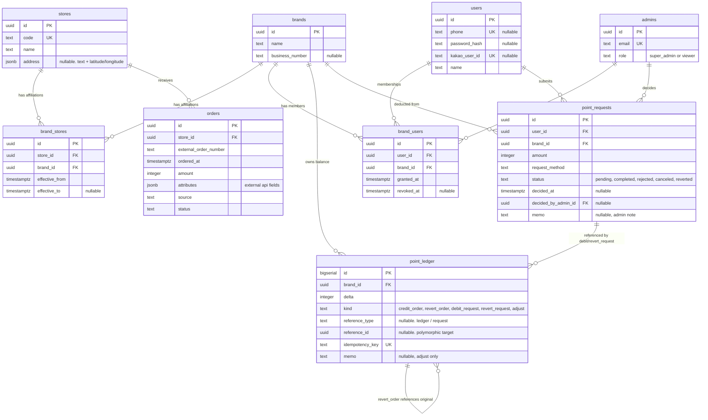

# Data Model

[service.md](service.md)의 결정 사항을 기반으로 한 PostgreSQL 데이터 모델.

---

## 1. 네이밍 / 타입 컨벤션

| 항목 | 규칙 |
| --- | --- |
| 테이블명 | `snake_case`, **복수형** (예: `brands`, `point_ledger`) |
| 컬럼명 | `snake_case`, **단수형** |
| **줄임말 회피** | **컬럼·JSONB 키 명은 완전한 단어로 표기.** 권장 변환표는 §1.1 참조. **예외**: `id` (universal), `_at` 접미사(영어 전치사), `api`·`url`·`json` 등 표준 acronym, 사전 등재 단어(`phone`, `email`, `admin`, `memo`). 본문 단위 표기는 가능 — 예: 100bps는 narrative에서 허용, 컬럼명에는 금지. |
| 기본키 | `id` — UUID v4 (`point_ledger`만 BIGSERIAL) |
| 외래키 | `{table_singular}_id` (예: `brand_id`, `store_id`, `admin_id`) |
| 시각 | `..._at` (TIMESTAMPTZ, UTC 저장) |
| 불리언 | `is_...` 접두사 |
| 금액 | **INTEGER (원 단위)**. FLOAT/NUMERIC 사용 금지 |
| 비율 | `..._basis_points` (INTEGER, 100 = 1%) |
| 소프트 삭제 | `archived_at` TIMESTAMPTZ NULL |
| 열거형 | TEXT + CHECK 제약 |
| 스냅샷 컬럼 | `..._snapshot` 또는 `..._at_evaluation` (이벤트 시점 값 보존) |
| 가변 속성 | `attributes`, `address` 등 JSONB |

### 1.1 줄임말 → 완전 명칭 변환표

| 줄임말 (금지) | 완전 명칭 (사용) |
| --- | --- |
| `lat` | `latitude` |
| `lng` | `longitude` |
| `zipcode` | `postal_code` |
| `no` (의미: number) | `number` |
| `business_no` | `business_number` |
| `external_order_no` | `external_order_number` |
| `ref_id` / `ref_type` | `reference_id` / `reference_type` |
| `bps` | `basis_points` |
| `rate_bps` | `rate_basis_points` |
| `at_eval` | `at_evaluation` |
| `min_*` | `minimum_*` |
| `max_*` | `maximum_*` |
| `qty` | `quantity` |
| `op` (JSON 키, 의미: operator) | `operator` |

---

## 2. ERD



> 범례: `||--o{` 1:N · `||--||` 1:1 · M:N은 조인 테이블을 통한 두 개의 1:N으로 표현.

---

## 3. 테이블 명세

### 3.1 `brands`

프랜차이즈 단위. 단일 매장이어도 1행 생성.

| 컬럼 | 타입 | 제약 | 설명 |
| --- | --- | --- | --- |
| `id` | UUID | PK | |
| `name` | TEXT | NOT NULL | |
| `business_number` | TEXT | NULL | 사업자등록번호 |
| `created_at` | TIMESTAMPTZ | NOT NULL DEFAULT now() | |
| `updated_at` | TIMESTAMPTZ | NOT NULL DEFAULT now() | |
| `archived_at` | TIMESTAMPTZ | NULL | soft delete |

### 3.2 `stores`

가맹점. **소속 Brand는 `brand_stores` 조인 테이블로 관리되며** (§3.5), 시간에 따라 변경될 수 있다.

| 컬럼 | 타입 | 제약 | 설명 |
| --- | --- | --- | --- |
| `id` | UUID | PK | |
| `code` | TEXT | NOT NULL, UNIQUE | Two Star 원장상의 가맹점 코드. 주문 인입 매칭 키 |
| `name` | TEXT | NOT NULL | |
| `address` | JSONB | NULL | 주소 정보 (텍스트 + 좌표 등 통합) |
| `created_at` | TIMESTAMPTZ | NOT NULL DEFAULT now() | |
| `updated_at` | TIMESTAMPTZ | NOT NULL DEFAULT now() | |
| `archived_at` | TIMESTAMPTZ | NULL | |

인덱스: `(code)` UNIQUE.

#### 3.2.1 `address` JSONB 표준 구조

```json
{
  "text": "서울특별시 강남구 테헤란로 ...",
  "latitude": 37.5172,
  "longitude": 127.0473,
  "road_address": "...",
  "postal_code": "..."
}
```

- `text` 입력 시 **Kakao Local REST API**로 1회 지오코딩하여 `latitude`/`longitude`을 같은 JSONB에 함께 채워 저장.
- 지도 렌더링은 `address.latitude`/`address.longitude`만 사용 (지오코딩 재호출 없음).
- Kakao Map (Web JS SDK)을 사용하며, JS SDK용 키(클라이언트 노출)와 REST API용 키(서버 보관)를 분리 발급한다.

#### 3.2.2 리워드 대상 제외

데이터 모델에 별도 컬럼은 두지 않는다. 제외 대상 store/brand가 있다면 **policy handler 내부에서 store_id·brand_id로 분기**해 처리한다 (예: `if order.store_id in EXCLUDED_STORES: return None`).

### 3.3 `users`

리워드 조회·포인트 사용 신청 주체. role 없음. **단/복수의 Brand를 소유**한다 (M:N, §3.4).

| 컬럼 | 타입 | 제약 | 설명 |
| --- | --- | --- | --- |
| `id` | UUID | PK | |
| `phone` | TEXT | UNIQUE NULL | E.164 권장 (`+82...`). 카카오 단독 가입 시 NULL 허용 |
| `password_hash` | TEXT | NULL | argon2id |
| `kakao_user_id` | TEXT | UNIQUE NULL | 카카오 로그인 식별자 |
| `name` | TEXT | NOT NULL | |
| `created_at` | TIMESTAMPTZ | NOT NULL DEFAULT now() | |
| `updated_at` | TIMESTAMPTZ | NOT NULL DEFAULT now() | |
| `archived_at` | TIMESTAMPTZ | NULL | |

**CHECK 제약**: 적어도 하나의 인증 수단이 설정되어야 한다.

```sql
CHECK (
  kakao_user_id IS NOT NULL
  OR (phone IS NOT NULL AND password_hash IS NOT NULL)
)
```

### 3.4 `brand_users`

User ↔ Brand **M:N** 관계. **Admin이 직접 관리**한다 (별도 신청 워크플로 없음).

| 컬럼 | 타입 | 제약 | 설명 |
| --- | --- | --- | --- |
| `id` | UUID | PK | |
| `user_id` | UUID | NOT NULL, FK → `users.id` | |
| `brand_id` | UUID | NOT NULL, FK → `brands.id` | |
| `granted_at` | TIMESTAMPTZ | NOT NULL DEFAULT now() | 권한 부여 시각 |
| `revoked_at` | TIMESTAMPTZ | NULL | 권한 회수 시각. NULL이면 활성 |

**부분 UNIQUE**: `(user_id, brand_id) WHERE revoked_at IS NULL` — 활성 멤버십 1건만.

#### 3.4.1 운영 정책

- **권한 부여**: Admin이 admin 화면에서 user를 brand에 직접 추가 → INSERT (`granted_at=now()`).
- **권한 회수**: UPDATE `revoked_at = now()`. 행 자체는 보존되어 이력 추적 가능.
- **재부여**: 회수된 행은 그대로 두고, 새 행을 INSERT (`revoked_at = NULL`).
- 사용자가 직접 신청하는 흐름은 없음. brand·store 관리와 동일하게 admin 운영 영역.

### 3.5 `brand_stores`

Store ↔ Brand **M:N** 관계 (시간 차원 포함). 같은 매장이 시간에 따라 다른 brand에 귀속될 수 있다.

| 컬럼 | 타입 | 제약 | 설명 |
| --- | --- | --- | --- |
| `id` | UUID | PK | |
| `store_id` | UUID | NOT NULL, FK → `stores.id` | |
| `brand_id` | UUID | NOT NULL, FK → `brands.id` | |
| `effective_from` | TIMESTAMPTZ | NOT NULL DEFAULT now() | 효력 시작 |
| `effective_to` | TIMESTAMPTZ | NULL | NULL이면 현재까지 유효 |
| `created_at` | TIMESTAMPTZ | NOT NULL DEFAULT now() | |

**부분 UNIQUE**: `(store_id) WHERE effective_to IS NULL` — 한 시점에 store당 활성 brand 1개만.

인덱스: `(store_id, effective_from DESC)`, `(brand_id, effective_to)`.

#### 3.5.1 운영 정책

- brand·store 등록과 매핑은 **모두 admin이 진행**한다. 별도 `created_by_admin_id` 컬럼은 두지 않는다.
- 신규 store 등록 시 트랜잭션 내에서 `brand_stores` 활성 행 1개를 함께 생성.
- 소속 brand 변경 시: (1) 기존 활성 행의 `effective_to`를 변경 시점으로 set, (2) 새 brand로 활성 행을 새로 insert.
- 과거 매핑은 UPDATE/DELETE 하지 않는다 (감사 추적 보존).
- **동시 다중 brand 소속**이 필요해지면 부분 UNIQUE만 풀면 되나, 이 경우 `orders`에 `brand_id` 명시 컬럼이 추가로 필요해진다.

### 3.6 `admins`

운영자.

| 컬럼 | 타입 | 제약 | 설명 |
| --- | --- | --- | --- |
| `id` | UUID | PK | |
| `email` | TEXT | NOT NULL, UNIQUE | |
| `password_hash` | TEXT | NOT NULL | argon2id |
| `name` | TEXT | NOT NULL | |
| `role` | TEXT | NOT NULL, CHECK IN (`super_admin`, `viewer`) | |
| `is_active` | BOOLEAN | NOT NULL DEFAULT TRUE | |
| `created_at` | TIMESTAMPTZ | NOT NULL DEFAULT now() | |
| `updated_at` | TIMESTAMPTZ | NOT NULL DEFAULT now() | |

### 3.7 `orders`

가맹점 주문 1건. 리워드 산정의 트리거.

| 컬럼 | 타입 | 제약 | 설명 |
| --- | --- | --- | --- |
| `id` | UUID | PK | |
| `store_id` | UUID | NOT NULL, FK → `stores.id` | |
| `external_order_number` | TEXT | NOT NULL | Two Star 원장 주문번호 |
| `ordered_at` | TIMESTAMPTZ | NOT NULL | 실제 주문 발생 시각 (적립 기준) |
| `amount` | INTEGER | NOT NULL, CHECK > 0 | KRW |
| `attributes` | JSONB | NULL | 외부 API 비정형 필드 (category, channel 등) |
| `source` | TEXT | NOT NULL, CHECK IN (`manual_upload`, `external_api`) | |
| `status` | TEXT | NOT NULL, CHECK IN (`active`, `canceled`) DEFAULT `active` | |
| `received_at` | TIMESTAMPTZ | NOT NULL DEFAULT now() | 시스템 인입 시각 |
| `canceled_at` | TIMESTAMPTZ | NULL | |

**UNIQUE (`store_id`, `external_order_number`)** — 중복 인입 방지.

인덱스: `(store_id, ordered_at DESC)`.

### 3.8 `point_ledger`

포인트 원장. **재무 진실(financial truth)만** 기록하는 순수 append-only 테이블. **워크플로 상태는 [`point_requests`](#39-point_requests) (§3.9)가 담당**한다.

| 컬럼 | 타입 | 제약 | 설명 |
| --- | --- | --- | --- |
| `id` | BIGSERIAL | PK | |
| `brand_id` | UUID | NOT NULL, FK → `brands.id` | 포인트는 brand 단위 귀속 |
| `delta` | INTEGER | NOT NULL | 양수=적립, 음수=차감 |
| `kind` | TEXT | NOT NULL, CHECK IN (`credit_order`, `revert_order`, `debit_request`, `revert_request`, `adjust`) | |
| `reference_type` | TEXT | NULL, CHECK IN (`ledger`, `request`) | 폴리모픽 참조 종류. credit_order·adjust는 NULL |
| `reference_id` | UUID | NULL | 참조 대상 식별자 (§3.8.1 매핑 참조) |
| `idempotency_key` | TEXT | NOT NULL, UNIQUE | 중복 처리 방지 |
| `memo` | TEXT | NULL | `adjust` 시 사유 (application에서 필수 강제) |
| `created_at` | TIMESTAMPTZ | NOT NULL DEFAULT now() | |

**제약**: `reference_type IS NULL ↔ reference_id IS NULL` (둘은 함께 NULL이거나 함께 not NULL).

#### 3.8.1 Kind ↔ reference 매핑

| Kind | reference_type | reference_id 대상 | 비고 |
| --- | --- | --- | --- |
| `credit_order` | `NULL` | `NULL` | 원본 order는 `idempotency_key`에 박힘. 적용 율은 `delta ÷ amount` 역산 |
| `revert_order` | `ledger` | 원본 credit_order ledger 행의 `id` | 환원 대상을 직접 지칭 |
| `debit_request` | `request` | `point_requests.id` | 사용 신청 완료 시 |
| `revert_request` | `request` | `point_requests.id` | 동일 신청 환원 |
| `adjust` | `NULL` | `NULL` | 외부 참조 없음 (수동 보정) |

> 적립 율 계산은 application 코드의 하드코딩 함수가 담당하며 정책 테이블 자체가 없다. 원본 주문 ID는 `idempotency_key = "credit:{order_id}:{brand_id}"`에 박혀 보존.

#### 3.8.2 Mutability 규칙

- **INSERT만 허용. UPDATE / DELETE 금지. 예외 없음.**
- 모든 정정·환원은 **반대 방향 INSERT** (`kind='adjust'` 또는 `kind='revert_*'`)로만 처리.

#### 3.8.3 Idempotency 키 규약

| Kind | 키 형식 |
| --- | --- |
| `credit_order` | `credit:{order_id}:{brand_id}` |
| `revert_order` | `revert:credit:{original_entry_id}` |
| `debit_request` | `debit_request:{request_id}` |
| `revert_request` | `revert:debit_request:{request_id}` |
| `adjust` | `adjust:{uuid}` |

> `debit_request`의 UNIQUE 제약이 같은 request의 중복 완료 처리를 차단한다.

인덱스: `(brand_id, created_at DESC)`, `(reference_type, reference_id)`.

> Brand별 잔액은 `SUM(delta) WHERE brand_id = ?` 로 직접 계산. 정책 적용 율은 `delta / order.amount`로 역산 가능 (orders 테이블 보존 전제).

### 3.9 `point_requests`

포인트 사용 신청 **워크플로 객체**. status는 가변 — 신청 → 완료 / 반려 / 취소 / 환원으로 진전.

| 컬럼 | 타입 | 제약 | 설명 |
| --- | --- | --- | --- |
| `id` | UUID | PK | |
| `user_id` | UUID | NOT NULL, FK → `users.id` | 신청자 |
| `brand_id` | UUID | NOT NULL, FK → `brands.id` | 차감 대상 brand |
| `amount` | INTEGER | NOT NULL, CHECK > 0 | 신청 금액 (양수) |
| `request_method` | TEXT | NOT NULL | 지급 방식 코드 (§6.4) |
| `status` | TEXT | NOT NULL DEFAULT `'pending'`, CHECK IN (`pending`, `completed`, `rejected`, `canceled`, `reverted`) | |
| `decided_at` | TIMESTAMPTZ | NULL | 처리 시각 (완료·반려·취소·환원 시 set) |
| `decided_by_admin_id` | UUID | NULL, FK → `admins.id` | |
| `memo` | TEXT | NULL | admin 노트 (반려·취소·환원 사유 등). `status='rejected'`일 때 application에서 필수 강제 |
| `requested_at` | TIMESTAMPTZ | NOT NULL DEFAULT now() | |
| `updated_at` | TIMESTAMPTZ | NOT NULL DEFAULT now() | |

인덱스: `(user_id, requested_at DESC)`, `(brand_id, status, requested_at DESC)`, `(status, requested_at DESC)`.

#### 3.9.1 상태 라이프사이클

```
                   ┌────► canceled            (사용자/관리자 취소, ledger 변동 없음)
                   │
   create ──► pending ────► completed         (관리자 완료, ledger debit_request INSERT)
                   │            │
                   │            └──► reverted (사후 환원, ledger revert_request INSERT)
                   │
                   └────► rejected            (관리자 반려, ledger 변동 없음)
```

- `pending → completed` / `completed → reverted` **두 전이에서만 `point_ledger` 변동**이 발생한다.
- `rejected` / `canceled`는 ledger를 건드리지 않는다 (pending 상태에서는 잔액 영향 없었으므로).

#### 3.9.2 Mutability 규칙

- 다음 컬럼만 UPDATE 가능: `status`, `decided_at`, `decided_by_admin_id`, `memo`, `updated_at`.
- 그 외 컬럼(특히 `amount`, `request_method`)은 INSERT 후 변경 금지.

#### 3.9.3 잔액과 pending의 관계

**Pending 신청은 잔액에 영향 없음.** 잔액 = `SUM(point_ledger.delta)` 만으로 계산되며 pending 신청은 가차감하지 않는다.

- 신청 등록 시 서버 검증: `SUM(point_ledger.delta WHERE brand_id) >= amount`. 미달 시 거부.
- 동시 pending 신청의 합이 잔액을 초과할 수 있음 → admin이 일부만 완료, 나머지 반려 등 결정.
- (선택적) 클라이언트 UX에서 "표시용 가용 잔액 = 잔액 − SUM(pending amount)"로 안내 가능 (서버 강제 아님).

> Brand별 잔액은 `SUM(delta) WHERE brand_id = ?` 로 직접 계산.

---

## 4. 핵심 제약 / 정책 요약

### 4.1 멱등성 키

| 이벤트 | 멱등 보장 위치 |
| --- | --- |
| 동일 주문 재인입 | `orders (store_id, external_order_number)` UNIQUE |
| 동일 주문 재적립 | `point_ledger.idempotency_key = "credit:{order_id}:{brand_id}"` UNIQUE |
| 동일 신청 완료 (중복 차감) | `point_ledger.idempotency_key = "debit_request:{request_id}"` UNIQUE |
| 환원 중복 | `revert:*:*` 형태로 원본 참조 |

### 4.2 Brand 결정 (Brand Resolution)

주문 1건의 **귀속 Brand는 `brand_stores`로부터 시간 기반으로 결정**된다.

```sql
SELECT brand_id FROM brand_stores
WHERE store_id = $order_store_id
  AND effective_from <= $order_ordered_at
  AND (effective_to IS NULL OR $order_ordered_at < effective_to);
```

- 결과 0건 → 적립 미발생 (운영자 알림 대상)
- 결과 2건 이상 → 데이터 무결성 위반 (§3.5 부분 UNIQUE가 보장)

### 4.3 적립 율 계산

율 산정은 **application 코드의 하드코딩 함수**가 담당. 별도 정책 테이블이나 환경 변수 없음.

```python
def calculate_credit_rate(order: Order) -> int | None:
    """basis points 반환. None 또는 0이면 적립 미발생."""
    # 차등화가 필요하면 여기서 분기 (예: store_id, brand_id, amount 등)
    if order.amount >= 100000:
        return 250  # 고액 보너스 2.5%
    return 100      # 기본 1%
```

변경 = 함수 수정 + deploy. brand·store별 차등이 필요하면 함수 내부에서 직접 분기.

### 4.4 적립 평가 알고리즘

```
1. resolve brand (§4.2 — brand_stores 시간 매핑)
   - 매핑 없음 → 즉시 종료 (적립 없음, 운영자 알림)
2. rate = calculate_credit_rate(order)
3. rate is None 또는 rate == 0 → ledger insert 생략 (적립 미발생)
4. point = floor(order.amount * rate / 10_000)    -- 절사
5. point_ledger에 1행 insert:
   { brand_id=resolved_brand, delta=+point, kind='credit_order',
     reference_type=NULL, reference_id=NULL,
     idempotency_key='credit:{order_id}:{brand_id}' }
```

> 원본 주문 ID는 `idempotency_key`에 박혀 보존. 적용 율은 `delta ÷ order.amount`로 역산.

### 4.5 적용 예시

현재 `calculate_credit_rate`가 위 예시 함수(고액 보너스)라고 가정. brands·stores·orders 샘플은 단순 — 정책 관련 컬럼 없음.

**예 1 — 고액 주문.** `amount=150000`:
- `calculate_credit_rate`: `150000 ≥ 100000` → 250bps → `point = floor(150000 × 250 / 10000) = 3750`
- ledger: `{ brand_id: b-002, delta: +3750, kind: 'credit_order', reference_type: NULL, reference_id: NULL, idempotency_key: 'credit:order-789:b-002' }`

**예 2 — 일반 주문.** `amount=30000`:
- `calculate_credit_rate`: `30000 < 100000` → 100bps → `point = 300`

**예 3 — 특정 매장 제외 (코드 내 분기).** 본사직영 매장 제외:
```python
EXCLUDED_STORES = {'XP-003'}

def calculate_credit_rate(order: Order) -> int | None:
    if order.store_id in EXCLUDED_STORES:
        return None  # 적립 미발생
    if order.amount >= 100000:
        return 250
    return 100
```

**예 4 — 적립 로직 교체.** 함수 본문 수정 → deploy → 이후 주문부터 새 로직 적용. 과거 ledger는 영향 없음.

### 4.6 append-only 보장

- **`point_ledger`: INSERT만 허용. UPDATE / DELETE 금지. 예외 없음.**
- `point_requests`: 워크플로 진행을 위해 `status`, `decided_at`, `decided_by_admin_id`, `memo`, `updated_at`만 UPDATE 가능.
- 모든 재무적 정정은 ledger에 반대 방향 INSERT (`kind='adjust'` 또는 `revert_*`)로만 처리.

### 4.7 잔액 계산

```sql
-- Brand 잔액 = ledger 합산
SELECT COALESCE(SUM(delta), 0) AS balance
FROM point_ledger
WHERE brand_id = $1;
```

별도 캐시 테이블 없음. 인덱스 `(brand_id, created_at DESC)`로 충분히 빠름.

### 4.8 적립 로직 변경의 영향 범위

- 적립 율은 **하드코딩 함수** (`calculate_credit_rate`). DB·환경 변수에 정책 정보 없음.
- 로직 변경 = 함수 수정 + 코드 deploy.
- 과거 ledger 행은 영향 없음. 적용 율은 `delta ÷ order.amount`로 역산 (orders 테이블 보존 전제).
- 차등화(특정 brand·store에 다른 율, 제외 등)는 함수 내부의 if 분기로 구현.

---

## 5. 주문 인입

### 5.1 인입 경로

- **수기 업로드 (`.xlsx` / `.csv`)** — Admin이 직접 업로드. MVP 기본 경로. **파싱은 프론트엔드에서 수행**하여 백엔드로는 정규화된 JSON 배열을 전송한다 — 백엔드는 파일 포맷·인코딩 처리 부담 없이 외부 API 경로와 동일한 검증 로직을 재사용. 프론트 파싱은 UX 레이어이며 백엔드가 모든 행을 다시 전량 검증한다.
- **외부 API 연동** — 인프라 인터페이스까지만 정의. 실제 어댑터 구현은 후속.

`orders.source`로 두 경로를 구분 (CHECK IN (`manual_upload`, `external_api`)).

### 5.2 업로드 정책

- **부분 성공 불허**. 파일 전체가 유효해야 등록 가능. 한 row라도 검증 실패 시 파일 전체 거부.
- 동일 주문 중복 방지: `orders (store_id, external_order_number)` UNIQUE.

### 5.3 시제 기준

| 컬럼 | 의미 |
| --- | --- |
| `orders.ordered_at` | 실제 주문 발생 시각 → **리워드 산정 기준** |
| `orders.received_at` | 시스템 인입 시각 → 감사 / 인입 지연 추적 |

### 5.4 외부 API 필드 수용

외부 API의 비정형 필드는 `orders.attributes` JSONB에 저장. handler 함수가 `order.attributes.<key>`를 참조하여 분기 가능 (§3.7.1 type 카탈로그 참조).

---

## 6. 포인트 사용 (Request) 워크플로

상품 카탈로그·승인 단계 없이 **사용자가 금액과 지급 방식을 입력 → 운영자가 외부에서 수동 지급 → 시스템에서 완료 처리만**하면 된다. 완료 처리 시점에 비로소 `point_ledger`에 차감이 기록된다.

### 6.1 사용자 신청

1. 사용자는 다음을 선택:
   - **차감 대상 brand** (복수 brand 소유 시 직접 선택)
   - **금액** (정수, KRW)
   - **지급 방식** (`request_method` — §6.4)
2. 서버 검증: `SUM(point_ledger.delta WHERE brand_id) >= amount`. 미달 시 거부.
3. INSERT `point_requests`:
   ```
   { user_id, brand_id, amount, request_method,
     status='pending', requested_at=now() }
   ```
4. **`point_ledger`는 변동 없음** — pending 신청은 잔액에 영향 주지 않는다.

### 6.2 Admin 처리

관리자는 (1) 관리자 페이지에서 pending 신청을 조회 → (2) **외부에서 직접 지급** (컬쳐랜드 상품권 발급·전송 등) → (3) "완료 처리" 버튼 클릭.
"완료 처리" 한 번으로 트랜잭션이 실행되어 신청이 `completed`로 변하고 동시에 ledger 차감이 INSERT 된다.

| 액션 | 변경 |
| --- | --- |
| **완료** | (트랜잭션) UPDATE `point_requests`: `status='completed'`, `decided_at`, `decided_by_admin_id` **AND** INSERT `point_ledger`: `kind='debit_request'`, `delta=-amount`, `reference_type='request'`, `reference_id=request.id`, `idempotency_key='debit_request:{request.id}'` |
| 반려 | UPDATE `point_requests`: `status='rejected'`, `memo` (사유), `decided_at`, `decided_by_admin_id`. **Ledger 변동 없음.** |
| 취소 (pending 상태에서) | UPDATE `point_requests`: `status='canceled'`, `decided_at`. **Ledger 변동 없음.** |
| 사후 환원 (드물게) | (트랜잭션) UPDATE `point_requests`: `status='reverted'`, `decided_at`, `decided_by_admin_id` **AND** INSERT `point_ledger`: `kind='revert_request'`, `delta=+amount`, `reference_type='request'`, `reference_id=request.id`, `idempotency_key='revert:debit_request:{request.id}'` |

### 6.3 차감 대상 Brand 결정

복수 Brand 소유 사용자는 신청 시 **직접 brand 선택**.

- **포인트는 Brand 단위로 별도 관리**되며 합쳐서 사용할 수 없다.
- Dashboard의 잔액 합산 표시는 **조회용**일 뿐, 실제 사용은 Brand 단위.

### 6.4 지급 방식 (Payment Methods)

`request_method`는 **application-level 카탈로그**로 관리한다 (별도 테이블 없음).

- 정확한 method 코드 목록은 **TBD** (§8). method별 추가 정보 (이메일·전화·주소 등)는 **시스템 외부에서 admin이 직접 사용자와 확인** — DB 컬럼으로 보유하지 않음.
- 예상 후보: 컬쳐랜드 상품권, 스타벅스 e-기프티콘, 신세계 상품권 등.

---

## 7. 마이그레이션 / 초기 데이터

- (정책 시드 없음 — 적립 로직은 application 코드 함수에 하드코딩)
- `admins` super_admin 1명 시드.
- brand·store·`brand_stores` 매핑은 admin이 등록.
- `brand_users`는 admin이 admin 화면에서 직접 INSERT (별도 신청 워크플로 없음).
- `point_requests` / `point_ledger`는 빈 상태에서 시작.

---

## 8. 미결 사항 (TBD)

- **외부 API `attributes` 필드 표준** — 외부 ERP/주문 시스템에서 들어올 비정형 필드(예: `category`, `channel`, `customer_type`)의 이름·타입 표준이 확정되면, 룰 작성·검증 가이드를 별도 문서화한다.
- **지급 방식 카탈로그 (`request_method` 코드)** — 어떤 방식을 지원할지 (컬쳐랜드 상품권, 스타벅스 e-기프티콘 등) 표준화 필요. 사용자 추가 정보(이메일·전화 등)는 시스템 외부에서 admin이 사용자와 직접 확인.

### 해결된 사항

- ~~복수 Brand 소유 User의 차감 Brand 결정 정책~~ → **§6.5**: 사용자가 신청 시 직접 선택.
- ~~`users.phone` NOT NULL과 카카오 단독 로그인 충돌~~ → **§3.3**: `phone` NULL 허용 + CHECK 제약.
- ~~잔액 캐시 운영 방식~~ → **§4.7**: 캐시 없이 `SUM(delta)` 직접 계산.
- ~~상품 카탈로그·신청 워크플로~~ → **§6**: `products` / `product_requests` 테이블 제거.
- ~~워크플로 상태와 ledger 단일 테이블 통합 (mutability 예외)~~ → **§3.10 신설**: `point_requests` 테이블 분리. `point_ledger`는 순수 append-only로 회복. Pending 신청은 잔액에 영향 없음 — 완료 처리 시점에 ledger 차감.
- ~~`brand_users` 신청 워크플로 테이블 (brand_user_requests)~~ → 제거. **§3.4**: brand_users는 admin이 직접 INSERT/회수하는 단순 M:N 테이블 (brand·store 관리와 동일한 패턴).
- ~~`point_policies.updated_by_admin_id`~~ → **§3.7**: admin만 수정 가능하므로 actor 컬럼 제거 (인증 로그로 추적).
- ~~`point_policies.definition` JSONB + 룰 평가기~~ → **§3.7**: `type` TEXT로 단순화. 계산 로직은 application 코드의 `POLICY_HANDLERS` 맵에 위임. `point_ledger.applied_override_key` 컬럼도 제거.
- ~~`point_ledger.point_policy_id` + `rate_basis_points_at_evaluation` + `adjusted_by_admin_id`~~ → **§3.9**: 3개 컬럼 모두 제거. credit_order는 `reference_type='policy'` + `reference_id=policy.id`로 통합. revert_order는 `reference_type='ledger'` + 원본 ledger.id. 적용 율은 `delta ÷ amount`로 역산. 보정자는 admin만 가능하므로 인증 로그로 추적.
- ~~`point_requests.request_details` JSONB~~ → **§3.10**: 제거. 지급 방식별 추가 정보(이메일·전화·주소 등)는 시스템 외부에서 admin이 사용자와 직접 확인.
- ~~`point_requests.rejection_reason`~~ → **§3.10**: `memo`로 명칭 변경. 반려 시 필수이지만, 다른 상태 전이의 admin 노트로도 사용 가능 (point_ledger.memo와 일관성).
- ~~`brands.point_policy_id` + `stores.point_policy_id`~~ → **§3.1, §3.2**: 두 FK 컬럼 모두 제거. brand/store별 정책 차등화는 데이터 모델 아닌 handler 내부 분기로 처리.
- ~~`point_policies.is_default` + `is_active`~~ → **§3.7**: 두 컬럼 모두 제거. point_policies는 항상 1행만 갖는 singleton (상수 UNIQUE 인덱스). brand/store FK가 없으므로 "어떤 정책을 쓸지" 선택 개념 자체 불필요.
- ~~`point_policies` 테이블 전체~~ → **§3.7 폐기**: 1행 singleton조차 over-engineering. 적립 율은 application 코드의 `calculate_credit_rate(order)` 하드코딩 함수가 담당. 변경 = 함수 수정 + deploy. ledger의 `reference_type` 후보에서 `'policy'` 제거, credit_order는 `reference_type=NULL`. §4.3을 "정책 결정"에서 "적립 율 계산"으로 재작성.
- ~~`stores.is_reward_target` (재정리)~~ → **§3.2.2**: 데이터 모델 컬럼 없음. 제외 처리는 handler 내부에서 `order.store_id`로 분기.
- ~~`stores.is_reward_target`~~ → **§3.2.2**: `point_policy_id`에 "제외 정책" 지정으로 표현.
- ~~`stores`의 `address` / `latitude` / `longitude` 분리 컬럼~~ → **§3.2.1**: `address` JSONB로 통합.
- ~~`brand_memberships`~~ → **§3.4**: `brand_users`로 명명 변경.
- ~~`reward_policies`~~ → **§3.7**: `point_policies`로 명명 변경.
- ~~`point_ledger_entries`~~ → **§3.9**: `point_ledger`로 명명 변경.
- ~~`users.default_shipping_address`~~ → 제거 (상품 신청 폐지로 불필요).
- ~~`brands.business_number`~~ → **§3.1**: 사업자등록번호 컬럼 추가.
- ~~`brand_stores.created_by_admin_id`~~ → 제거 (모든 등록이 admin 수행이라 redundant).
