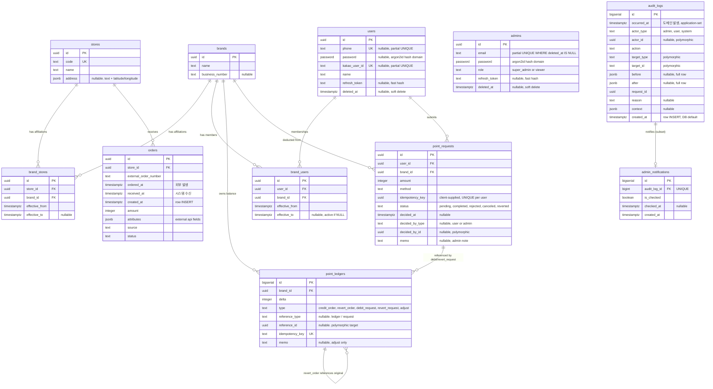

# Data Model

[service.md](service.md)의 결정 사항을 기반으로 한 PostgreSQL 데이터 모델.

---

## 1. 네이밍 / 타입 컨벤션

| 항목 | 규칙 |
| --- | --- |
| 테이블명 | `snake_case`, **복수형** (예: `brands`, `point_ledgers`, `audit_logs`). mass noun 도 복수형 통일 |
| 엔티티 명칭 (audit `target_type` / action prefix) | **테이블명 동일 (복수형)**. 예: `orders.upload_batch`, `target_type='users'` |
| 컬럼명 | `snake_case`, **단수형** |
| 외래키 컬럼명 | `{테이블명 단수형}_id`. 예: `users` → `user_id`, `audit_logs` → `audit_log_id` |
| **줄임말 회피** | **컬럼·JSONB 키 명은 완전한 단어로 표기.** 권장 변환표는 §1.1 참조. **예외**: `id` (universal), `_at` 접미사(영어 전치사), `api`·`url`·`json` 등 표준 acronym, 사전 등재 단어(`phone`, `email`, `admin`, `memo`). 본문 단위 표기는 가능 — 예: 100bps는 narrative에서 허용, 컬럼명에는 금지. |
| 기본키 | `id` — UUID v4 (`point_ledgers`, `audit_logs`, `admin_notifications` 는 BIGSERIAL) |
| 시각 (단일 시점) | `..._at` (TIMESTAMPTZ, UTC 저장). §1.3 |
| 시간 범위 (기간) | `effective_from` / `effective_to` (TIMESTAMPTZ). §1.4 |
| 불리언 | `is_...` 접두사 |
| 금전 절대량 | `amount` (INTEGER, **원 단위**). FLOAT/NUMERIC 금지. CHECK > 0. 사용자 입력·신청·주문 등 양수 금액 |
| 금전 변화량 (signed) | `delta` (INTEGER, **원 단위**). FLOAT/NUMERIC 금지. 부호로 방향 표현 (+ 적립, − 차감). 재무 원장 (`point_ledgers`) 전용 |
| 비율 | `..._basis_points` (INTEGER, 100 = 1%) |
| 소프트 삭제 | `deleted_at` TIMESTAMPTZ NULL |
| 열거형 | TEXT + CHECK 제약 |
| 스냅샷 컬럼 | `..._snapshot` 또는 `..._at_evaluation` (이벤트 시점 값 보존) |
| 가변 속성 | `attributes`, `address` 등 JSONB |
| 비밀번호 | `PASSWORD` 도메인 (TEXT 위) — argon2id 해시 저장. §1.2 참조 |

### 1.1 줄임말 → 완전 명칭 변환표

| 줄임말 (금지) | 완전 명칭 (사용) |
| --- | --- |
| `lat` | `latitude` |
| `lng` | `longitude` |
| `zipcode` | `postal_code` |
| `no` (의미: number) | `number` |
| `business_no` | `business_number` |
| `external_order_no` | `external_order_number` |
| `ref_id` / `ref_type` | `reference_id` / `reference_type` |
| `bps` | `basis_points` |
| `rate_bps` | `rate_basis_points` |
| `at_eval` | `at_evaluation` |
| `min_*` | `minimum_*` |
| `max_*` | `maximum_*` |
| `qty` | `quantity` |
| `op` (JSON 키, 의미: operator) | `operator` |

### 1.2 `PASSWORD` 도메인

비밀번호 컬럼은 **컬럼명을 `password`** 로, **자료형을 `PASSWORD` 도메인** 으로 표기한다. 도메인은 TEXT 위에 정의되며, 저장되는 값은 항상 argon2id 해시 형식.

```sql
CREATE DOMAIN password AS TEXT
  CHECK (VALUE ~ '^\$argon2id\$');
```

- 컬럼명이 `password_hash` 가 아니라 `password` 인 이유: hash 임은 *자료형*(PASSWORD 도메인) 이 보장. 컬럼명에 또 박을 필요 없음.
- application 은 어떤 경우에도 plain text 를 이 컬럼에 INSERT 할 수 없다 (CHECK 위반).
- 검증·해싱은 application 코드 (argon2id 라이브러리) 가 담당. DB 함수 사용 안 함.

### 1.3 `..._at` 컬럼 설명 표준

모든 `..._at` 컬럼의 설명은 다음 패턴으로 통일한다:

```
[행위] 시각                              -- NOT NULL 인 경우
[행위] 시각. NULL이면 [상태]              -- NULL 허용 시
[행위] 시각 ([부가 의미])                 -- 추가 컨텍스트 필요 시
```

- **`created_at` / `updated_at`** 은 모든 테이블 공통 메타. 설명은 **생략** (반복 noise 방지). 의미는 본 §1.3 에 한 번 정의:
  - `created_at` = row 생성 시각 (NOT NULL DEFAULT now())
  - `updated_at` = row 최종 수정 시각 (NOT NULL DEFAULT now())
- **도메인 이벤트 _at** (`deleted_at`, `canceled_at`, `decided_at`, `ordered_at`, `received_at`, `occurred_at`, `checked_at`, …) 은 각 §3.X 표에 위 패턴 그대로 표기.
- `[행위]` 는 컬럼 prefix 의 의미 동사 명사형. 일관된 한 단어 (`삭제`, `탈퇴`, `취소`, `처리`, `확인`, `주문`, `인입`, `신청`, `발생` 등).
- **단일 시점만 다룬다.** 관계의 *유효 기간* (시작 + 종료) 은 §1.4 의 `effective_from` / `effective_to` 패턴을 사용한다.

### 1.4 시간 범위 (`effective_from` / `effective_to`)

관계나 매핑이 **시간 차원으로 유효한 기간** 을 가지는 경우, 단일 `_at` 컬럼이 아니라 **범위 경계 쌍**으로 표기한다.

```
effective_from   TIMESTAMPTZ NOT NULL DEFAULT now()  -- 효력 시작
effective_to     TIMESTAMPTZ NULL                     -- 효력 종료. NULL이면 현재 활성
```

- **부분 UNIQUE** 로 "한 시점에 활성 관계 1건" 강제 가능: `(키 컬럼들) WHERE effective_to IS NULL`.
- **활성 row 종료** = `effective_to = now()` UPDATE (hard delete 안 함). 과거 row 는 보존.
- **재활성화** = 새 row INSERT (`effective_from = now()`, `effective_to = NULL`).
- 시간 매핑 조회 (특정 시점에 어떤 row 가 활성이었나):
  ```sql
  WHERE effective_from <= $t AND ($t < effective_to OR effective_to IS NULL)
  ```

> `granted_at` / `revoked_at`, `started_at` / `ended_at`, `valid_from` / `valid_to` 같은 변형은 사용하지 않는다. **모든 시간 범위는 `effective_from` / `effective_to` 로 통일**. 도메인 의미는 audit 액션 verb (`brand_users.grant` 등) 가 담당.

해당 패턴 사용 테이블: `brand_users` (§3.4), `brand_stores` (§3.5).

---

## 2. ERD



> 범례: `||--o{` 1:N · `||--||` 1:1 · M:N은 조인 테이블을 통한 두 개의 1:N으로 표현.
>
> **admins 관계선 부재**: admin 이 `brand_users` 를 등록·회수하고 `point_requests` 를 처리하지만, 도메인 테이블에는 admin FK 컬럼이 없다 (광범위 actor 추적은 `audit_logs` 가 담당, `point_requests.decided_by_*` 는 폴리모픽으로 FK 없음). 즉 admin → 도메인 테이블 관계는 audit-only.
>
> `audit_logs`는 모든 도메인 엔티티를 폴리모픽 `(target_type, target_id)`로 참조 — FK 관계선 생략. `admin_notifications` 는 `audit_logs` 의 부분집합에 1:1 로 매핑 (FK 보유).

---

## 3. 테이블 명세

### 3.1 `brands`

프랜차이즈 단위. 단일 매장이어도 1행 생성.

| 컬럼 | 타입 | 제약 | 설명 |
| --- | --- | --- | --- |
| `id` | UUID | PK | |
| `name` | TEXT | NOT NULL | |
| `business_number` | TEXT | NULL | 사업자등록번호 |
| `created_at` | TIMESTAMPTZ | NOT NULL DEFAULT now() | |
| `updated_at` | TIMESTAMPTZ | NOT NULL DEFAULT now() | |
| `deleted_at` | TIMESTAMPTZ | NULL | 삭제 시각. NULL이면 활성 |

### 3.2 `stores`

가맹점. **소속 Brand는 `brand_stores` 조인 테이블로 관리되며** (§3.5), 시간에 따라 변경될 수 있다.

| 컬럼 | 타입 | 제약 | 설명 |
| --- | --- | --- | --- |
| `id` | UUID | PK | |
| `code` | TEXT | NOT NULL, UNIQUE | Two Star 원장상의 가맹점 코드. 주문 인입 매칭 키 |
| `name` | TEXT | NOT NULL | |
| `address` | JSONB | NULL | 주소 정보 (텍스트 + 좌표 등 통합) |
| `created_at` | TIMESTAMPTZ | NOT NULL DEFAULT now() | |
| `updated_at` | TIMESTAMPTZ | NOT NULL DEFAULT now() | |
| `deleted_at` | TIMESTAMPTZ | NULL | 삭제 시각. NULL이면 활성 |

인덱스: `(code)` UNIQUE.

#### 3.2.1 `address` JSONB 표준 구조

```json
{
  "text": "서울특별시 강남구 테헤란로 ...",
  "latitude": 37.5172,
  "longitude": 127.0473,
  "road_address": "...",
  "postal_code": "..."
}
```

- `text` 입력 시 **Kakao Local REST API**로 1회 지오코딩하여 `latitude`/`longitude`을 같은 JSONB에 함께 채워 저장.
- 지도 렌더링은 `address.latitude`/`address.longitude`만 사용 (지오코딩 재호출 없음).
- Kakao Map (Web JS SDK)을 사용하며, JS SDK용 키(클라이언트 노출)와 REST API용 키(서버 보관)를 분리 발급한다.

#### 3.2.2 리워드 대상 제외

데이터 모델에 별도 컬럼은 두지 않는다. 제외 대상 store/brand가 있다면 **policy handler 내부에서 store_id·brand_id로 분기**해 처리한다 (예: `if order.store_id in EXCLUDED_STORES: return None`).

### 3.3 `users`

리워드 조회·포인트 사용 신청 주체. role 없음. **단/복수의 Brand를 소유**한다 (M:N, §3.4).

| 컬럼 | 타입 | 제약 | 설명 |
| --- | --- | --- | --- |
| `id` | UUID | PK | |
| `phone` | TEXT | NULL | E.164 권장 (`+82...`). 카카오 단독 가입 시 NULL 허용 |
| `password` | `PASSWORD` | NULL | argon2id 해시. §1.2 도메인 |
| `kakao_user_id` | TEXT | NULL | 카카오 로그인 식별자 |
| `name` | TEXT | NOT NULL | |
| `refresh_token` | TEXT | NULL | 활성 refresh token 의 fast hash (SHA-256 등). 로그아웃·rotate 시 NULL 또는 새 값. raw token 저장 금지 |
| `created_at` | TIMESTAMPTZ | NOT NULL DEFAULT now() | |
| `updated_at` | TIMESTAMPTZ | NOT NULL DEFAULT now() | |
| `deleted_at` | TIMESTAMPTZ | NULL | 탈퇴 시각. NULL이면 활성 |

**부분 UNIQUE** (활성 사용자만):
- `(phone) WHERE deleted_at IS NULL AND phone IS NOT NULL`
- `(kakao_user_id) WHERE deleted_at IS NULL AND kakao_user_id IS NOT NULL`

> 탈퇴 후 동일 번호·카카오 계정으로 재가입을 허용하기 위해 부분 UNIQUE 사용. 과거 (deleted) row 는 보존되며 잔류 식별자는 충돌하지 않는다.

**CHECK 제약**: 적어도 하나의 인증 수단이 설정되어야 한다.

```sql
CHECK (
  kakao_user_id IS NOT NULL
  OR (phone IS NOT NULL AND password IS NOT NULL)
)
```

> `refresh_token` 은 단일 활성 토큰을 단순 보관 (다중 디바이스 미지원). access token 갱신 시 클라이언트가 보낸 raw token 의 hash 가 이 컬럼과 일치하는지 검증. rotate 시 새 hash 로 UPDATE. 로그아웃 시 NULL 로 set. 만료 정보는 토큰 자체 (`exp` claim) 가 보유 — DB 에 별도 컬럼 없음.

#### 3.3.1 탈퇴 정책

- 탈퇴는 **soft delete**: `deleted_at = now()` UPDATE. row 자체는 보존.
- PII 마스킹·익명화는 **현재 적용 안 함** (`phone`, `name`, `kakao_user_id` 그대로 잔존).
- `point_requests` · `audit_logs` 의 `actor_id` 는 그대로 보존 — 분쟁·감사 추적 가능.
- 활성 사용자 조회는 항상 `WHERE deleted_at IS NULL` (application 레이어에서 강제).
- 본격 PII 정책(법령 대응 익명화, 보존 기간 등)은 §8 TBD.

### 3.4 `brand_users`

User ↔ Brand **M:N** 관계. **Admin이 직접 관리**한다 (별도 신청 워크플로 없음).

| 컬럼 | 타입 | 제약 | 설명 |
| --- | --- | --- | --- |
| `id` | UUID | PK | |
| `user_id` | UUID | NOT NULL, FK → `users.id` | |
| `brand_id` | UUID | NOT NULL, FK → `brands.id` | |
| `effective_from` | TIMESTAMPTZ | NOT NULL DEFAULT now() | 효력 시작 (§1.4) |
| `effective_to` | TIMESTAMPTZ | NULL | 효력 종료. NULL이면 현재 활성 (§1.4) |
| `created_at` | TIMESTAMPTZ | NOT NULL DEFAULT now() | (§1.3) — row INSERT 시각 |

**부분 UNIQUE**: `(user_id, brand_id) WHERE effective_to IS NULL` — 활성 멤버십 1건만.

#### 3.4.1 운영 정책

- **권한 부여**: Admin이 admin 화면에서 user를 brand에 직접 추가 → INSERT (`effective_from = now()`, `effective_to = NULL`).
- **권한 회수**: UPDATE `effective_to = now()`. 행 자체는 보존되어 이력 추적 가능.
- **재부여**: 회수된 행은 그대로 두고, 새 행을 INSERT.
- 사용자가 직접 신청하는 흐름은 없음. brand·store 관리와 동일하게 admin 운영 영역.

### 3.5 `brand_stores`

Store ↔ Brand **M:N** 관계 (시간 차원 포함). 같은 매장이 시간에 따라 다른 brand에 귀속될 수 있다.

| 컬럼 | 타입 | 제약 | 설명 |
| --- | --- | --- | --- |
| `id` | UUID | PK | |
| `store_id` | UUID | NOT NULL, FK → `stores.id` | |
| `brand_id` | UUID | NOT NULL, FK → `brands.id` | |
| `effective_from` | TIMESTAMPTZ | NOT NULL DEFAULT now() | 효력 시작 (§1.4) |
| `effective_to` | TIMESTAMPTZ | NULL | 효력 종료. NULL이면 현재 활성 (§1.4) |
| `created_at` | TIMESTAMPTZ | NOT NULL DEFAULT now() | |

**부분 UNIQUE**: `(store_id) WHERE effective_to IS NULL` — 한 시점에 store당 활성 brand 1개만.

인덱스: `(store_id, effective_from DESC)`, `(brand_id, effective_to)`.

#### 3.5.1 운영 정책

- brand·store 등록과 매핑은 **모두 admin이 진행**한다. 별도 `created_by_admin_id` 컬럼은 두지 않는다.
- 신규 store 등록 시 트랜잭션 내에서 `brand_stores` 활성 행 1개를 함께 생성.
- 소속 brand 변경 시: (1) 기존 활성 행의 `effective_to`를 변경 시점으로 set, (2) 새 brand로 활성 행을 새로 insert.
- 과거 매핑은 UPDATE/DELETE 하지 않는다 (감사 추적 보존).
- **동시 다중 brand 소속**이 필요해지면 부분 UNIQUE만 풀면 되나, 이 경우 `orders`에 `brand_id` 명시 컬럼이 추가로 필요해진다.

### 3.6 `admins`

운영자.

| 컬럼 | 타입 | 제약 | 설명 |
| --- | --- | --- | --- |
| `id` | UUID | PK | |
| `email` | TEXT | NOT NULL | |
| `password` | `PASSWORD` | NOT NULL | argon2id 해시. §1.2 도메인 |
| `name` | TEXT | NOT NULL | |
| `role` | TEXT | NOT NULL, CHECK IN (`super_admin`, `viewer`) | |
| `refresh_token` | TEXT | NULL | 활성 refresh token 의 fast hash. raw token 저장 금지. 로그아웃·rotate 시 NULL 또는 새 값 |
| `created_at` | TIMESTAMPTZ | NOT NULL DEFAULT now() | |
| `updated_at` | TIMESTAMPTZ | NOT NULL DEFAULT now() | |
| `deleted_at` | TIMESTAMPTZ | NULL | 삭제 시각. NULL이면 활성 |

**부분 UNIQUE**: `(email) WHERE deleted_at IS NULL` — 활성 admin 의 email 만 유일. 삭제된 admin 의 email 은 재사용 가능 (또는 동일 인물 재등록 가능).

> 비활성화는 **soft delete** (`deleted_at = now()`). hard delete 금지 — `point_requests.decided_by_id` (admin 참조 시) · `audit_logs.actor_id` 등의 참조가 끊기지 않도록 보존. 비활성 admin 은 로그인 불가 (application 레이어에서 `WHERE deleted_at IS NULL` 강제).

### 3.7 `orders`

가맹점 주문 1건. 리워드 산정의 트리거.

| 컬럼 | 타입 | 제약 | 설명 |
| --- | --- | --- | --- |
| `id` | UUID | PK | |
| `store_id` | UUID | NOT NULL, FK → `stores.id` | |
| `external_order_number` | TEXT | NOT NULL | Two Star 원장 주문번호 |
| `ordered_at` | TIMESTAMPTZ | NOT NULL | 주문 시각 (리워드 산정 기준) |
| `amount` | INTEGER | NOT NULL, CHECK > 0 | KRW |
| `attributes` | JSONB | NULL | 외부 API 비정형 필드 (category, channel 등) |
| `source` | TEXT | NOT NULL, CHECK IN (`manual_upload`, `external_api`) | |
| `status` | TEXT | NOT NULL, CHECK IN (`active`, `canceled`) DEFAULT `active` | |
| `received_at` | TIMESTAMPTZ | NOT NULL | 인입 시각 (application-set, API/파일 수신 시점) |
| `created_at` | TIMESTAMPTZ | NOT NULL DEFAULT now() | (§1.3) — row INSERT 시각 |
| `canceled_at` | TIMESTAMPTZ | NULL | 취소 시각. NULL이면 활성 |

**UNIQUE (`store_id`, `external_order_number`)** — 중복 인입 방지.

인덱스: `(store_id, ordered_at DESC)`.

### 3.8 `point_ledgers`

포인트 원장. **재무 진실(financial truth)만** 기록하는 순수 append-only 테이블. **워크플로 상태는 [`point_requests`](#39-point_requests) (§3.9)가 담당**한다.

| 컬럼 | 타입 | 제약 | 설명 |
| --- | --- | --- | --- |
| `id` | BIGSERIAL | PK | |
| `brand_id` | UUID | NOT NULL, FK → `brands.id` | 포인트는 brand 단위 귀속 |
| `delta` | INTEGER | NOT NULL | 양수=적립, 음수=차감 |
| `type` | TEXT | NOT NULL, CHECK IN (`credit_order`, `revert_order`, `debit_request`, `revert_request`, `adjust`) | |
| `reference_type` | TEXT | NULL, CHECK IN (`ledger`, `request`) | 폴리모픽 참조 종류. credit_order·adjust는 NULL |
| `reference_id` | UUID | NULL | 참조 대상 식별자 (§3.8.1 매핑 참조) |
| `idempotency_key` | TEXT | NOT NULL, UNIQUE | 중복 처리 방지 |
| `memo` | TEXT | NULL | `adjust` 시 사유 (application에서 필수 강제) |
| `created_at` | TIMESTAMPTZ | NOT NULL DEFAULT now() | |

**제약**:
- `reference_type IS NULL ↔ reference_id IS NULL` (둘은 함께 NULL이거나 함께 NOT NULL).
- **type ↔ delta 부호 일관성 CHECK** — 재무 진실 보호:
  ```sql
  CHECK (
    (type IN ('credit_order', 'revert_request') AND delta > 0)
    OR (type IN ('revert_order', 'debit_request') AND delta < 0)
    OR (type = 'adjust' AND delta <> 0)
  )
  ```
  `debit_request` 에 양수 delta 같은 부호 실수가 silent 통과 되지 않고 DB가 즉시 거부. 금전 사고 사전 차단.

#### 3.8.1 Type ↔ reference 매핑

| Type | reference_type | reference_id 대상 | 비고 |
| --- | --- | --- | --- |
| `credit_order` | `NULL` | `NULL` | 원본 order는 `idempotency_key`에 박힘. 적용 율은 `delta ÷ amount` 역산 |
| `revert_order` | `ledger` | 원본 credit_order ledger 행의 `id` | 환원 대상을 직접 지칭 |
| `debit_request` | `request` | `point_requests.id` | 사용 신청 완료 시 |
| `revert_request` | `request` | `point_requests.id` | 동일 신청 환원 |
| `adjust` | `NULL` | `NULL` | 외부 참조 없음 (수동 보정) |

> 적립 율 계산은 application 코드의 하드코딩 함수가 담당하며 정책 테이블 자체가 없다. 원본 주문 ID는 `idempotency_key = "credit:{order_id}:{brand_id}"`에 박혀 보존.

#### 3.8.2 Mutability 규칙

- **INSERT만 허용. UPDATE / DELETE 금지. 예외 없음.**
- 모든 정정·환원은 **반대 방향 INSERT** (`type='adjust'` 또는 `type='revert_*'`)로만 처리.

#### 3.8.3 Idempotency 키 규약

| Type | 키 형식 |
| --- | --- |
| `credit_order` | `credit:{order_id}:{brand_id}` |
| `revert_order` | `revert:credit:{original_entry_id}` |
| `debit_request` | `debit_request:{request_id}` |
| `revert_request` | `revert:debit_request:{request_id}` |
| `adjust` | `adjust:{uuid}` |

> `debit_request`의 UNIQUE 제약이 같은 request의 중복 완료 처리를 차단한다.

인덱스: `(brand_id, created_at DESC)`, `(reference_type, reference_id)`.

> Brand별 잔액은 `SUM(delta) WHERE brand_id = ?` 로 직접 계산. 정책 적용 율은 `delta / order.amount`로 역산 가능 (orders 테이블 보존 전제).

### 3.9 `point_requests`

포인트 사용 신청 **워크플로 객체**. status는 가변 — 신청 → 완료 / 반려 / 취소 / 환원으로 진전.

| 컬럼 | 타입 | 제약 | 설명 |
| --- | --- | --- | --- |
| `id` | UUID | PK | |
| `user_id` | UUID | NOT NULL, FK → `users.id` | 신청자 |
| `brand_id` | UUID | NOT NULL, FK → `brands.id` | 차감 대상 brand |
| `amount` | INTEGER | NOT NULL, CHECK > 0 | 신청 금액 (양수) |
| `method` | TEXT | NOT NULL | 지급 방식 코드 (§6.4) |
| `idempotency_key` | UUID | NOT NULL | 클라이언트 발급 멱등성 키 (§4.1). `point_ledgers.idempotency_key` 와 동일 개념·다른 발급 주체 |
| `status` | TEXT | NOT NULL DEFAULT `'pending'`, CHECK IN (`pending`, `completed`, `rejected`, `canceled`, `reverted`) | |
| `decided_at` | TIMESTAMPTZ | NULL | 처리 시각. NULL이면 pending |
| `decided_by_type` | TEXT | NULL, CHECK IN (`user`, `admin`) | 처리자 종류 (폴리모픽) |
| `decided_by_id` | UUID | NULL | 처리자 식별자. `decided_by_type='user'` → `users.id`, `'admin'` → `admins.id` (폴리모픽 — FK 없음) |
| `memo` | TEXT | NULL | 처리 노트 (반려·취소·환원 사유 등). `status='rejected'`일 때 application에서 필수 강제 |
| `requested_at` | TIMESTAMPTZ | NOT NULL | 신청 시각 (application-set) |
| `created_at` | TIMESTAMPTZ | NOT NULL DEFAULT now() | (§1.3) — row INSERT 시각 |
| `updated_at` | TIMESTAMPTZ | NOT NULL DEFAULT now() | |

**제약 — decided_by 일관성 CHECK**:

```sql
CHECK (
  (status = 'pending' AND decided_by_type IS NULL AND decided_by_id IS NULL AND decided_at IS NULL)
  OR (status <> 'pending' AND decided_by_type IN ('user', 'admin') AND decided_by_id IS NOT NULL AND decided_at IS NOT NULL)
)
```

`pending` 상태는 `decided_*` 3개 모두 NULL, 그 외 상태로 전이 시 모두 NOT NULL 을 DB-level 로 강제. application 버그·중간 상태 INSERT 차단.

**UNIQUE**: `(user_id, idempotency_key)` — 동일 user 의 동일 키 재전송 차단. 더블탭·재시도로 인한 중복 신청 방지.

인덱스: `(user_id, requested_at DESC)`, `(brand_id, status, requested_at DESC)`, `(status, requested_at DESC)`.

> `idempotency_key` 는 클라이언트(브라우저·앱)가 "신청" 액션 1회당 UUID v4를 생성해 첨부. 서버 재시도·네트워크 retry 가 같은 UUID 로 들어오면 두 번째 INSERT 는 UNIQUE 위반으로 차단되고, application 은 이를 "동일 신청 — 기존 row 반환" 으로 변환한다. **이름은 `point_ledgers.idempotency_key` 와 동일하지만 발급 주체와 scope 가 다르다** — §4.1 참조.

#### 3.9.1 상태 라이프사이클

```
                   ┌────► canceled            (사용자/관리자 취소, ledger 변동 없음)
                   │
   create ──► pending ────► completed         (관리자 완료, ledger debit_request INSERT)
                   │            │
                   │            └──► reverted (사후 환원, ledger revert_request INSERT)
                   │
                   └────► rejected            (관리자 반려, ledger 변동 없음)
```

- `pending → completed` / `completed → reverted` **두 전이에서만 `point_ledgers` 변동**이 발생한다.
- `rejected` / `canceled`는 ledger를 건드리지 않는다 (pending 상태에서는 잔액 영향 없었으므로).

#### 3.9.2 Mutability 규칙

- 다음 컬럼만 UPDATE 가능: `status`, `decided_at`, `decided_by_type`, `decided_by_id`, `memo`, `updated_at`.
- 그 외 컬럼(특히 `amount`, `method`, `idempotency_key`)은 INSERT 후 변경 금지.

#### 3.9.3 잔액과 pending의 관계

**Pending 신청은 잔액에 영향 없음.** 잔액 = `SUM(point_ledgers.delta)` 만으로 계산되며 pending 신청은 가차감하지 않는다.

- 신청 등록 시 서버 검증: `SUM(point_ledgers.delta WHERE brand_id) >= amount`. 미달 시 거부.
- 동시 pending 신청의 합이 잔액을 초과할 수 있음 → admin이 일부만 완료, 나머지 반려 등 결정.
- (선택적) 클라이언트 UX에서 "표시용 가용 잔액 = 잔액 − SUM(pending amount)"로 안내 가능 (서버 강제 아님).

> Brand별 잔액은 `SUM(delta) WHERE brand_id = ?` 로 직접 계산.

### 3.10 `audit_logs`

운영자·사용자 액션의 **누가 / 언제 / 무엇을** 추적. 도메인 테이블 외부에서 감사 추적을 전담한다. 도메인 테이블의 actor 컬럼은 **워크플로 상태에 필수적인 경우만** 잔존 (예: `point_requests.decided_by_type` / `decided_by_id` 는 워크플로 진행에 직접 쓰임). 그 외 광범위 actor 추적 (등록·수정·삭제 누가 했나) 은 audit_logs 가 일원화.

| 컬럼 | 타입 | 제약 | 설명 |
| --- | --- | --- | --- |
| `id` | BIGSERIAL | PK | |
| `occurred_at` | TIMESTAMPTZ | NOT NULL | 발생 시각 (application-set, 도메인 액션이 일어난 시점) |
| `actor_type` | TEXT | NOT NULL, CHECK IN (`admin`, `user`, `system`) | |
| `actor_id` | UUID | NULL | `admin` → `admins.id`, `user` → `users.id`, `system` → NULL |
| `action` | TEXT | NOT NULL | 표준화된 verb (§4.9.2 카탈로그). 예: `point_ledgers.adjust`, `orders.upload_batch` |
| `target_type` | TEXT | NOT NULL | **테이블명 (복수형)**. 실재 테이블 (`orders`, `point_ledgers`, `point_requests`, `brands`, `stores`, `brand_users`, `brand_stores`, `admins`, `users`) 또는 가상 엔티티 (`order_batches`, §3.10.2) |
| `target_id` | TEXT | NOT NULL | UUID 또는 BIGINT 를 TEXT 로 통일 (폴리모픽) |
| `before` | JSONB | NULL | 변경 전 row 상태 (full row JSON). INSERT 시 NULL |
| `after` | JSONB | NULL | 변경 후 row 상태 (full row JSON). DELETE 시 NULL |
| `request_id` | UUID | NOT NULL | HTTP 요청 상관 ID. 한 요청에서 발생한 여러 row 묶기 (§4.9.3) |
| `reason` | TEXT | NULL | adjust 사유 등 자유 텍스트 |
| `context` | JSONB | NULL | IP / user_agent / batch_size / file_name 등 부가 메타 |
| `created_at` | TIMESTAMPTZ | NOT NULL DEFAULT now() | (§1.3) — row INSERT 시각 |

**제약**:
- INSERT only. UPDATE / DELETE 금지 — `point_ledgers` 와 동일 원칙.
- **actor 일관성 CHECK**:
  ```sql
  CHECK (
    (actor_type = 'system' AND actor_id IS NULL)
    OR (actor_type IN ('admin', 'user') AND actor_id IS NOT NULL)
  )
  ```
  `system` 액션은 actor_id NULL, 그 외 (`admin`, `user`) 는 actor_id NOT NULL 을 DB-level 로 강제. application 버그로 잘못 INSERT 시 즉시 거부.

> **`occurred_at` vs `created_at`** — `occurred_at` 은 application 이 명시 set 하는 *도메인 액션 발생 시각*. `created_at` 은 DB DEFAULT 로 박히는 *row INSERT 시각*. 일반적으로 같은 트랜잭션에서 audit row 가 즉시 INSERT 되므로 두 값이 ms 단위로 같다. 단, **backfill** (과거 액션을 사후 기록), **delayed 처리** (큐를 거친 비동기 audit) 등에서는 의도적으로 분기됨. 분쟁 시 "언제 실제로 일어났나 (occurred_at)" 와 "언제 시스템에 기록됐나 (created_at)" 를 별개로 추적할 수 있음.

**인덱스**:
- `(actor_type, actor_id, occurred_at DESC)` — actor 별 조회
- `(target_type, target_id, occurred_at DESC)` — target 별 이력 조회
- `(action, occurred_at DESC)` — action 종류별 분석
- `(request_id)` — 요청 단위 그룹
- `(occurred_at DESC)` — 시간 역순 전체 스캔

#### 3.10.1 before / after 캡처 정책

- **Full JSONB row** 로 저장. JSON Patch / diff 비교 사용 안 함.
- INSERT: `after` = 신규 row JSON, `before` = NULL.
- UPDATE: `before` = 변경 전 row, `after` = 변경 후 row.
- 소프트 삭제 (`deleted_at` set) 및 시간 범위 종료 (`effective_to` set): UPDATE 와 동일 (`before` / `after` 둘 다).

> Full row 저장은 용량 약간 증가시키나 (PG JSONB 압축 + 본 시스템 row 크기 작음 → 무시 가능), diff 해석 코드 없이 단순 비교로 변경 내역을 즉시 가시화한다.

#### 3.10.2 `order_batches` 가상 엔티티

수기 업로드 (`/orders/register` §5.2.2) 는 N row 를 한 트랜잭션에 INSERT 한다. row 단위로 audit row N 개를 남기면 폭증.

→ **`target_type='order_batches'` 가상 엔티티 1행으로 묶어 기록**한다. `order_batches` 는 **DB 테이블로 존재하지 않는 가상 엔티티** — audit_logs 의 target 으로만 사용.

- `target_id` = batch UUID (트랜잭션 시작 시 생성. audit 외에는 사용 안 함)
- `action` = `orders.upload_batch`
- `after` = `{ count, store_ids: [...], ordered_at_range: [from, to], file_name }`
- `before` = NULL
- 동일 트랜잭션에서 자동 발생하는 `point_ledgers.credit_order` system audit row 들과 **같은 `request_id`** 로 묶여 추적됨 (§4.9.3).

> Row 단위 업로더 추적이 필요해지면: `audit_logs.request_id` 로 batch audit 을 찾아 → `actor_id` 획득. 도메인 테이블 (`orders`) 에는 actor 컬럼을 두지 않는다.

### 3.11 `admin_notifications`

`audit_logs` (§3.10) 의 **부분집합**에 대한 운영자 inbox. **본문은 audit_logs 가 보유**하고, 이 테이블은 "이 사건은 운영자가 봐야 한다" 표시 + ack 상태만 보유한다.

| 컬럼 | 타입 | 제약 | 설명 |
| --- | --- | --- | --- |
| `id` | BIGSERIAL | PK | |
| `audit_log_id` | BIGINT | NOT NULL, UNIQUE, FK → `audit_logs.id` | 본문 참조 (1:1) |
| `is_checked` | BOOLEAN | NOT NULL DEFAULT FALSE | 운영자 확인 여부 |
| `checked_at` | TIMESTAMPTZ | NULL | 확인 시각. NULL이면 미확인 |
| `created_at` | TIMESTAMPTZ | NOT NULL DEFAULT now() | |

**제약**:
- `audit_log_id` UNIQUE → 동일 audit row 의 중복 알림 차단 (멱등성 자동 확보).
- `is_checked = FALSE ↔ checked_at IS NULL` (application 강제).

**인덱스**: `(is_checked, created_at DESC)` — unchecked 우선 inbox 조회.

> severity / title / body 컬럼은 **두지 않는다**. 표시 데이터는 모두 `audit_logs` JOIN 으로 획득. severity 매핑은 application 코드가 `audit_logs.action` 기반으로 결정.

#### 3.11.1 Mutability 규칙

- INSERT 후 `is_checked` / `checked_at` 두 컬럼만 UPDATE 가능.
- `audit_log_id` 는 INSERT 후 변경 금지.
- DELETE 허용 — 오래된 checked 행 정리 가능 (`audit_logs` 와 달리 forensic 가치 낮음).

#### 3.11.2 본문 조회

```sql
SELECT n.id, n.created_at, n.is_checked, n.checked_at,
       a.action, a.actor_type, a.actor_id,
       a.target_type, a.target_id,
       a.reason, a.context
FROM admin_notifications n
JOIN audit_logs a ON a.id = n.audit_log_id
WHERE n.is_checked = FALSE
ORDER BY n.created_at DESC;
```

---

## 4. 핵심 제약 / 정책 요약

### 4.1 멱등성 키

| 이벤트 | 멱등 보장 위치 | 발급 주체 | scope |
| --- | --- | --- | --- |
| 동일 주문 재인입 | `orders (store_id, external_order_number)` UNIQUE | 외부 시스템 (Two Star 원장) | (store_id) per store |
| 동일 주문 재적립 | `point_ledgers.idempotency_key = "credit:{order_id}:{brand_id}"` UNIQUE | 시스템 (TEXT prefix) | global |
| 동일 신청 중복 INSERT (더블탭·재시도) | `point_requests (user_id, idempotency_key)` UNIQUE | 클라이언트 (UUID v4) | (user_id) per user |
| 동일 신청 완료 (중복 차감) | `point_ledgers.idempotency_key = "debit_request:{request_id}"` UNIQUE | 시스템 (TEXT prefix) | global |
| 환원 중복 | `revert:*:*` 형태로 원본 참조 (`point_ledgers.idempotency_key` UNIQUE) | 시스템 (TEXT prefix) | global |

> `point_ledgers.idempotency_key` (TEXT, 시스템 발급, structured prefix) 와 `point_requests.idempotency_key` (UUID, 클라이언트 발급) 는 **같은 이름·같은 개념 (멱등성 키) 이지만 발급 주체와 타입이 다르다**. point_requests 의 키는 user_id scope 부분 UNIQUE 라 globally 중복될 수 있음 (다른 user 가 우연히 같은 UUID 를 보낼 가능성 — 사실상 0).

### 4.2 Brand 결정 (Brand Resolution)

주문 1건의 **귀속 Brand는 `brand_stores`로부터 시간 기반으로 결정**된다.

```sql
SELECT brand_id FROM brand_stores
WHERE store_id = $order_store_id
  AND effective_from <= $order_ordered_at
  AND (effective_to IS NULL OR $order_ordered_at < effective_to);
```

- 결과 0건 → 적립 미발생 (운영자 알림 대상)
- 결과 2건 이상 → 데이터 무결성 위반 (§3.5 부분 UNIQUE가 보장)

### 4.3 적립 율 계산

율 산정은 **application 코드의 하드코딩 함수**가 담당. 별도 정책 테이블이나 환경 변수 없음.

```python
def calculate_credit_rate(order: Order) -> int | None:
    """basis points 반환. None 또는 0이면 적립 미발생."""
    # 차등화가 필요하면 여기서 분기 (예: store_id, brand_id, amount 등)
    if order.amount >= 100000:
        return 250  # 고액 보너스 2.5%
    return 100      # 기본 1%
```

변경 = 함수 수정 + deploy. brand·store별 차등이 필요하면 함수 내부에서 직접 분기.

### 4.4 적립 평가 알고리즘

각 order 1건마다:

```
1. resolve brand (§4.2 — brand_stores 시간 매핑)
   - 매핑 없음 → audit_logs INSERT
       (action='orders.credit_skipped', target_type='orders',
        reason='no_brand_mapping').
     종료. ledger insert 없음.
2. rate = calculate_credit_rate(order)
3. rate is None 또는 rate == 0 → audit_logs INSERT
       (action='orders.credit_skipped', target_type='orders',
        reason='rate_zero').
     종료. ledger insert 없음.
4. point = floor(order.amount * rate / 10_000)    -- 절사
5. point_ledgers에 1행 insert:
   { brand_id=resolved_brand, delta=+point, type='credit_order',
     reference_type=NULL, reference_id=NULL,
     idempotency_key='credit:{order_id}:{brand_id}' }
```

배치 (`/orders/register` §5.2.2) 종료 시점에 집계 1건:

```
batch 처리 후:
- skipped_count = 위 step 1·3 에서 스킵된 row 수
- skipped_count >= 1 이면 audit_logs INSERT
   (action='orders.credit_skipped_batch_summary',
    target_type='order_batches', target_id=batch_id,
    context={ skipped_count, reasons: {no_brand_mapping: N, rate_zero: M} })
  → 이 action 은 §4.10 NOTIFY 카탈로그 대상 → admin_notifications 1행 자동 INSERT
- skipped_count = 0 이면 summary audit / notification 모두 생략
```

> 원본 주문 ID는 `idempotency_key`에 박혀 보존. 적용 율은 `delta ÷ order.amount`로 역산. 적립 누락의 사유·통계는 `audit_logs` 로 즉시 추적 가능.

### 4.5 적용 예시

현재 `calculate_credit_rate`가 위 예시 함수(고액 보너스)라고 가정. brands·stores·orders 샘플은 단순 — 정책 관련 컬럼 없음.

**예 1 — 고액 주문.** `amount=150000`:
- `calculate_credit_rate`: `150000 ≥ 100000` → 250bps → `point = floor(150000 × 250 / 10000) = 3750`
- ledger: `{ brand_id: b-002, delta: +3750, type: 'credit_order', reference_type: NULL, reference_id: NULL, idempotency_key: 'credit:order-789:b-002' }`

**예 2 — 일반 주문.** `amount=30000`:
- `calculate_credit_rate`: `30000 < 100000` → 100bps → `point = 300`

**예 3 — 특정 매장 제외 (코드 내 분기).** 본사직영 매장 제외:
```python
EXCLUDED_STORES = {'XP-003'}

def calculate_credit_rate(order: Order) -> int | None:
    if order.store_id in EXCLUDED_STORES:
        return None  # 적립 미발생
    if order.amount >= 100000:
        return 250
    return 100
```

**예 4 — 적립 로직 교체.** 함수 본문 수정 → deploy → 이후 주문부터 새 로직 적용. 과거 ledger는 영향 없음.

### 4.6 append-only 보장

- **`point_ledgers`: INSERT만 허용. UPDATE / DELETE 금지. 예외 없음.**
- `point_requests`: 워크플로 진행을 위해 `status`, `decided_at`, `decided_by_type`, `decided_by_id`, `memo`, `updated_at`만 UPDATE 가능.
- 모든 재무적 정정은 ledger에 반대 방향 INSERT (`type='adjust'` 또는 `revert_*`)로만 처리.

### 4.7 잔액 계산

```sql
-- Brand 잔액 = ledger 합산
SELECT COALESCE(SUM(delta), 0) AS balance
FROM point_ledgers
WHERE brand_id = $1;
```

별도 캐시 테이블 없음. 인덱스 `(brand_id, created_at DESC)`로 충분히 빠름.

### 4.8 적립 로직 변경의 영향 범위

- 적립 율은 **하드코딩 함수** (`calculate_credit_rate`). DB·환경 변수에 정책 정보 없음.
- 로직 변경 = 함수 수정 + 코드 deploy.
- 과거 ledger 행은 영향 없음. 적용 율은 `delta ÷ order.amount`로 역산 (orders 테이블 보존 전제).
- 차등화(특정 brand·store에 다른 율, 제외 등)는 함수 내부의 if 분기로 구현.

### 4.9 감사 로그 정책

`audit_logs` (§3.10) 작성 규칙. **모든 mutating 액션** 은 같은 트랜잭션 내에서 audit row 1 건을 동반한다.

#### 4.9.1 기록 시점

서비스 레이어가 **도메인 변경과 같은 트랜잭션 내**에서 `audit_logs` INSERT.

```python
async with tx:
    # 1) 도메인 변경 (orders / point_requests / point_ledgers / brands / ...)
    # 2) audit_logs INSERT  ← 같은 트랜잭션
```

- 도메인 변경이 롤백되면 audit 도 롤백 → 항상 짝으로 존재 (orphan / phantom 없음).
- **DB trigger** 방식 채택 안 함: actor_id 를 PG session context 변수로 주입해야 해 복잡.
- **HTTP middleware (응답 후 기록)** 방식 채택 안 함: 트랜잭션 commit 후 별도 INSERT 라 실패 시 누락 가능.

#### 4.9.2 기록 대상 액션 카탈로그

**원칙**: **모든 state-changing 액션은 audit_logs 에 기록**한다. 조회성 GET 만 제외 (인프라 access log 영역).

| action | actor_type | target_type | 트리거 |
| --- | --- | --- | --- |
| **orders** | | | |
| `orders.upload_batch` | `admin` | `order_batches` | `/orders/register` commit 직전 (§3.10.2) |
| `orders.external_ingest` | `system` | `orders` | 외부 API (`source='external_api'`) 로 인입된 단건. 어댑터 구현 시 actor·context 결정 (§8 TBD) |
| `orders.cancel` | `admin` | `orders` | 단건 취소 |
| `orders.credit_skipped` | `system` | `orders` | §4.4 step 1·3 의 적립 미발생 시 (`reason` 컬럼에 `no_brand_mapping` / `rate_zero`). NOTIFY 대상 아님 (row 단위) |
| `orders.credit_skipped_batch_summary` | `system` | `order_batches` | batch 처리 종료 시 `skipped_count >= 1` 일 때 1행. **NOTIFY 대상** (§4.10) |
| **point_ledgers** (5종 모두 audit — 재무 진실의 모든 row 추적) | | | |
| `point_ledgers.credit_order` | `system` | `point_ledgers` | 자동 적립 INSERT (batch 와 동일 `request_id`) |
| `point_ledgers.revert_order` | `admin` | `point_ledgers` | `type='revert_order'` INSERT |
| `point_ledgers.debit_request` | `admin` | `point_ledgers` | `point_requests.decide`(완료) 의 동반 ledger INSERT (같은 `request_id`) |
| `point_ledgers.revert_request` | `admin` | `point_ledgers` | `point_requests.decide`(환원) 의 동반 ledger INSERT (같은 `request_id`) |
| `point_ledgers.adjust` | `admin` | `point_ledgers` | `type='adjust'` INSERT (수동 보정. `reason` 필수) |
| **point_requests** | | | |
| `point_requests.create` | `user` | `point_requests` | 사용자 신청 |
| `point_requests.decide` | `admin` / `user` | `point_requests` | `completed` / `rejected` / `canceled` / `reverted` 전이. `canceled` 는 user (본인 취소) 또는 admin, 나머지는 admin |
| **users** | | | |
| `users.create` | `user` | `users` | 가입 완료 (phone/kakao 경로는 `context.signup_source` 에 명시) |
| `users.update` | `user` | `users` | 본인 프로필 수정 (변경 필드는 `before` / `after` JSONB 로 추적) |
| `users.delete` | `user` | `users` | 본인 탈퇴 (`deleted_at` set) |
| **admins** | | | |
| `admins.create` / `.update` / `.delete` | `admin` | `admins` | super_admin 의 admin CRUD |
| **brands / stores / 매핑** | | | |
| `brands.create` / `.update` / `.delete` | `admin` | `brands` | 각 변경 |
| `stores.create` / `.update` / `.delete` | `admin` | `stores` | 각 변경 |
| `brand_stores.create` | `admin` | `brand_stores` | 매핑 추가 |
| `brand_stores.terminate` | `admin` | `brand_stores` | `effective_to` set |
| `brand_users.grant` | `admin` | `brand_users` | 권한 부여 |
| `brand_users.revoke` | `admin` | `brand_users` | `effective_to` set |
| **admin_notifications** | | | |
| `admin_notifications.check` | `admin` | `admin_notifications` | 운영자 알림 확인 (`is_checked = TRUE`, `checked_at` set). acker 추적 (테이블에 acker 컬럼 없음 — audit_logs 만으로) |
| **auth** | | | |
| `auth.login_success` | `admin` / `user` | `users` 또는 `admins` (target_id = actor 본인) | 인증 성공 |
| `auth.login_failure` | `system` (actor_id NULL) | `users` 또는 `admins` (target_id = 시도 identifier TEXT — 매칭 안 되면 입력값 그대로) | 인증 실패 |
| `auth.logout` | `admin` / `user` | `users` 또는 `admins` (target_id = actor 본인) | 로그아웃 (`refresh_token` NULL set + access token 무효화) |

**의도적 제외**:
- 조회성 GET — 인프라 access log 영역 (mutation 아님).

#### 4.9.3 `request_id` 사용

한 HTTP 요청에서 발생한 모든 audit row 는 동일 `request_id` 를 공유.

대표 케이스: 주문 batch 등록 1회
- `orders.upload_batch` 1 row (`actor=admin`)
- `point_ledgers.credit_order` N rows (`actor=system`, 자동 적립)
- 모두 같은 `request_id` → `WHERE request_id = ?` 로 한 요청의 전체 영향 추적

#### 4.9.4 Mutability

- INSERT only. UPDATE / DELETE 금지.
- 잘못 기록된 audit row 도 수정 불가. 정정이 필요하면 `action='audit.correction'` 류로 **새 row INSERT** (재무 ledger 와 동일 원칙).

#### 4.9.5 보존

- MVP: 무한 보존.
- 파티셔닝은 row > 1천만 또는 1년 이후 검토 (`occurred_at` 월별 RANGE).

### 4.10 알림 정책

`admin_notifications` (§3.11) 작성 규칙. `audit_logs` 의 **부분집합**만 운영자 inbox 에 노출한다.

#### 4.10.1 NOTIFY 카탈로그

알림 대상 action 은 **application 코드의 set 으로 관리** — DB 테이블 없음. 새 알림 종류 추가 = code 변경 + deploy. schema migration 불필요.

```python
# franchise_manager/notifications/catalog.py
NOTIFY_ACTIONS: set[str] = {
    "orders.credit_skipped_batch_summary",
    # 새 알림 종류는 여기에 추가
}
```

#### 4.10.2 기록 시점

`audit_logs` 정책 (§4.9.1) 의 자연 확장 — **같은 트랜잭션** 내에서 조건 INSERT:

```python
async with tx:
    # 1) 도메인 변경
    # 2) audit_logs INSERT
    audit_id = await audit.record(action=action, ...)
    # 3) NOTIFY 대상이면 admin_notifications INSERT (같은 트랜잭션)
    if action in NOTIFY_ACTIONS:
        await notifications.create(audit_log_id=audit_id)
```

- 도메인 / audit / notification 모두 같은 트랜잭션 → 알림 누락 불가.
- `audit_log_id` UNIQUE 제약 → 동일 audit 의 중복 알림 자동 차단.

#### 4.10.3 row 단위 vs batch summary

운영자 inbox 폭증 방지를 위해 **NOTIFY 대상은 batch / aggregate summary action 만 등재**한다. row 단위 audit 는 forensic 용으로만 남기고 알림화하지 않는다.

예: 주문 batch 100건 등록 → 3건 적립 스킵
- `audit_logs`: `orders.credit_skipped` row 3건 (row 단위, NOTIFY ❌)
- `audit_logs`: `orders.credit_skipped_batch_summary` row 1건. context = `{skipped_count: 3, reasons: {no_brand_mapping: 2, rate_zero: 1}}` (NOTIFY ✅)
- `admin_notifications`: row 1건 (audit_log_id = batch summary id)

운영자가 inbox 의 한 알림을 클릭하면 application 이 동일 `request_id` 로 row 단위 audit 들을 묶어 상세 표시.

#### 4.10.4 ack 워크플로

- 확인: `UPDATE admin_notifications SET is_checked=TRUE, checked_at=now() WHERE id = ?`.
- bulk ack: `WHERE id IN (...)`.
- ack 후 재발생 (며칠 후 동일 batch 가 또 스킵) 은 새 audit row → 새 notification row 로 표현. `audit_log_id` UNIQUE 가 동일 사건의 재알림은 자동 차단.

---

## 5. 주문 인입

### 5.1 인입 경로

- **수기 업로드 (`.xlsx` / `.csv`)** — Admin이 직접 업로드. MVP 기본 경로.
- **외부 API 연동** — 인프라 인터페이스까지만 정의. 실제 어댑터 구현은 후속.

`orders.source`로 두 경로를 구분 (CHECK IN (`manual_upload`, `external_api`)).

### 5.2 수기 업로드 흐름 — 파싱과 등록 분리

수기 업로드는 **stateless 2-step**으로 처리한다. 두 step은 별개의 endpoint이며, 서버는 파싱 결과를 보관하지 않는다 (staging 테이블 없음).

```
[Admin Browser]                              [API]
    │                                          │
    │─ .xlsx / .csv ─ POST /orders/parse ─────►│
    │                                          │ (파싱 + 전체 검증, INSERT 없음)
    │◄── 정규화 row 배열 + 검증 결과 ──────────│
    │                                          │
    │  (Admin이 미리보기에서 확인)              │
    │                                          │
    │─ rows ─────── POST /orders/register ────►│
    │                                          │ (단일 트랜잭션 INSERT + 적립 평가)
    │◄── 등록 결과 (생성 건수) ─────────────────│
```

#### 5.2.1 Step 1 — 파싱 / 변환

- **입력**: `.xlsx` 또는 `.csv` 파일 1개. 형식은 Content-Type / 확장자로 구분.
- **처리**: 파일 → `orders` 스키마에 맞춘 **정규화 row 배열**.
  - `stores.code` → `stores.id` resolve 포함.
  - `ordered_at` 은 ISO-8601 (TIMESTAMPTZ) 으로 정규화.
  - `attributes` 는 표준 컬럼 외 잔여 필드를 JSONB 형태로 묶음.
- **검증 (이 단계에서 전체 수행)**:
  - 스키마: 필수 컬럼 존재 (`store_code`, `external_order_number`, `ordered_at`, `amount`).
  - 타입: `amount` INTEGER > 0, `ordered_at` 파싱 가능.
  - 참조 무결성: `store_code` 가 활성 `stores.code` 와 매칭.
  - 파일 내 중복: 동일 `(store_code, external_order_number)` 없음.
  - 기존 DB 중복: `orders (store_id, external_order_number)` UNIQUE 와 충돌 없음.
- **출력 (성공)**: 정규화 row 배열 + 각 row의 resolved metadata (`store_id` 등).
- **출력 (실패)**: row index 별 에러 목록. **한 row라도 실패면 전체 invalid** — Step 2 진행 불가 (§5.2.3).
- **사이드 이펙트 없음**: `orders` INSERT 없음. 서버에 파일·결과 보관 없음. 클라이언트가 정규화 row 배열을 보유했다가 Step 2 에 그대로 재전송한다.

#### 5.2.2 Step 2 — 등록

- **입력**: Step 1 응답의 정규화 row 배열 (클라이언트가 변경 없이 재전송).
- **처리**: 전체를 **단일 트랜잭션**에서 `orders` INSERT (`source='manual_upload'`).
- **재검증**: 서버는 Step 1 의 검증 결과를 신뢰하지 않는다. DB 제약 (UNIQUE / FK / CHECK) 이 최종 게이트 — Step 1 ↔ Step 2 사이 race (예: 동일 주문 동시 업로드) 가 발생하면 INSERT 실패 → 트랜잭션 롤백 (§5.2.3).
- **적립 평가**: 트랜잭션 내에서 row 단위로 §4.4 알고리즘 실행 → `point_ledgers` credit_order INSERT 까지 동일 트랜잭션에 포함.

> 클라이언트가 Step 1 응답을 변조해도 Step 2 의 DB 제약이 무결성을 보장. Step 1 의 검증은 **UX** (전체 거부 전 미리보기) 와 **사전 차단** 용도이지 보안 경계가 아니다.

#### 5.2.3 부분 성공 불허

- Step 1: 한 row 라도 검증 실패 시 파일 전체 거부.
- Step 2: 트랜잭션 내 한 row 라도 INSERT 실패 시 전체 롤백.

#### 5.2.4 중복 방지

- 동일 주문 재인입은 `orders (store_id, external_order_number)` UNIQUE 가 최종 차단 (§4.1).
- Step 1 이 사전 감지하여 UX 로 안내, Step 2 트랜잭션에서 DB 가 최종 차단.

### 5.3 시제 기준

| 컬럼 | 의미 |
| --- | --- |
| `orders.ordered_at` | 외부에서 주문이 실제 발생한 시각 (Two Star 원장 기준) → **리워드 산정 기준** |
| `orders.received_at` | 시스템이 주문 데이터를 받은 시각 (HTTP/파일 수신 시점, **application 이 명시 set**) → 외부→시스템 지연 추적 |
| `orders.created_at` | row 가 DB 에 INSERT 된 시각 (`DEFAULT now()`) → 시스템 내부 처리 지연 추적 |

세 시각은 서로 다른 단계의 시점이며, 다음 지연 분석이 가능하다:

| 구간 | 의미 | 일반적 크기 |
| --- | --- | --- |
| `received_at − ordered_at` | 외부→시스템 지연. 수기 업로드 시 클 수 있음 (며칠 ~ 몇 주). | 시간 ~ 일 단위 |
| `created_at − received_at` | 시스템 내부 처리 지연. validation·batch 처리 등에 소요. | ms ~ 초 단위 (보통) |
| `created_at − ordered_at` | end-to-end 지연 | 위 둘의 합 |

> `received_at` 은 **application 코드가 명시 set** (request handler 진입 시점 또는 batch 처리 시작 시점). DB default 사용 안 함. row 1000건 batch INSERT 시 모든 row 의 `received_at` 은 동일 batch 시작 시각, `created_at` 은 행별 실제 INSERT 시각 → 두 값이 의도적으로 분기.

### 5.4 외부 API 필드 수용

외부 API의 비정형 필드는 `orders.attributes` JSONB에 저장. `calculate_credit_rate(order)` (§4.3) 가 `order.attributes.<key>` 를 참조하여 분기 가능. 표준 키 카탈로그는 §8 TBD.

---

## 6. 포인트 사용 (Request) 워크플로

상품 카탈로그·승인 단계 없이 **사용자가 금액과 지급 방식을 입력 → 운영자가 외부에서 수동 지급 → 시스템에서 완료 처리만**하면 된다. 완료 처리 시점에 비로소 `point_ledgers`에 차감이 기록된다.

### 6.1 사용자 신청

1. 클라이언트는 신청 액션 1회당 **`idempotency_key`** (UUID v4) 를 생성. 재시도 시에도 동일 키 유지 (§3.9 참조).
2. 사용자는 다음을 선택:
   - **차감 대상 brand** (복수 brand 소유 시 직접 선택)
   - **금액** (정수, KRW)
   - **지급 방식** (`method` — §6.4)
3. 서버 검증: `SUM(point_ledgers.delta WHERE brand_id) >= amount`. 미달 시 거부.
4. INSERT `point_requests`:
   ```
   { user_id, brand_id, amount, method, idempotency_key,
     status='pending', requested_at=now() }
   ```
   - `requested_at` 은 application 이 명시 set (DEFAULT 없음 — §3.9).
   - `(user_id, idempotency_key)` UNIQUE 위반 시 application 이 "기존 row 반환" 으로 변환.
5. **`point_ledgers`는 변동 없음** — pending 신청은 잔액에 영향 주지 않는다.

### 6.2 Admin 처리

관리자는 (1) 관리자 페이지에서 pending 신청을 조회 → (2) **외부에서 직접 지급** (컬쳐랜드 상품권 발급·전송 등) → (3) "완료 처리" 버튼 클릭.
"완료 처리" 한 번으로 트랜잭션이 실행되어 신청이 `completed`로 변하고 동시에 ledger 차감이 INSERT 된다.

| 액션 | 처리 주체 | 변경 |
| --- | --- | --- |
| **완료** | admin | (트랜잭션) UPDATE `point_requests`: `status='completed'`, `decided_at`, `decided_by_type='admin'`, `decided_by_id=admin.id` **AND** INSERT `point_ledgers`: `type='debit_request'`, `delta=-amount`, `reference_type='request'`, `reference_id=request.id`, `idempotency_key='debit_request:{request.id}'` |
| 반려 | admin | UPDATE `point_requests`: `status='rejected'`, `memo` (사유), `decided_at`, `decided_by_type='admin'`, `decided_by_id=admin.id`. **Ledger 변동 없음.** |
| 취소 (pending 상태) | user 또는 admin | UPDATE `point_requests`: `status='canceled'`, `decided_at`, `decided_by_type=('user'\|'admin')`, `decided_by_id=actor.id`. **Ledger 변동 없음.** |
| 사후 환원 (드물게) | admin | (트랜잭션) UPDATE `point_requests`: `status='reverted'`, `decided_at`, `decided_by_type='admin'`, `decided_by_id=admin.id` **AND** INSERT `point_ledgers`: `type='revert_request'`, `delta=+amount`, `reference_type='request'`, `reference_id=request.id`, `idempotency_key='revert:debit_request:{request.id}'` |

### 6.3 차감 대상 Brand 결정

복수 Brand 소유 사용자는 신청 시 **직접 brand 선택**.

- **포인트는 Brand 단위로 별도 관리**되며 합쳐서 사용할 수 없다.
- Dashboard의 잔액 합산 표시는 **조회용**일 뿐, 실제 사용은 Brand 단위.

### 6.4 지급 방식 (Payment Methods)

`method`는 **application-level 카탈로그**로 관리한다 (별도 테이블 없음).

- 정확한 method 코드 목록은 **TBD** (§8). method별 추가 정보 (이메일·전화·주소 등)는 **시스템 외부에서 admin이 직접 사용자와 확인** — DB 컬럼으로 보유하지 않음.
- 예상 후보: 컬쳐랜드 상품권, 스타벅스 e-기프티콘, 신세계 상품권 등.

---

## 7. 마이그레이션 / 초기 데이터

### 7.1 실행 순서

```
1. CREATE DOMAIN password         (§1.2 — argon2id 형식 CHECK)
2. CREATE TABLE 기초 (FK 없음):
   brands, stores, users, admins
3. CREATE TABLE 1차 FK:
   brand_stores  (→ brands, stores)
   brand_users   (→ brands, users)
4. CREATE TABLE orders            (→ stores)
5. CREATE TABLE point_requests    (→ users, brands)
6. CREATE TABLE point_ledgers     (→ brands)
7. CREATE TABLE audit_logs        (FK 없음, 폴리모픽)
8. CREATE TABLE admin_notifications  (→ audit_logs)
9. 부분 UNIQUE · CHECK · INDEX 일괄 적용
10. 시드: super_admin 1명 (argon2id 해시 박힘)
```

- Alembic 등 마이그레이션 도구를 쓸 경우 1번 (`CREATE DOMAIN`) 은 첫 revision 의 `op.execute(...)` 로 분리.

### 7.2 시드 데이터

- (정책 시드 없음 — 적립 로직은 application 코드 `calculate_credit_rate` 함수에 하드코딩)
- `admins`: super_admin 1명 (email + 미리 argon2id 해싱된 password).
- `brands` / `stores` / `brand_stores` 매핑: admin 이 admin 화면에서 등록.
- `brand_users`: admin 이 admin 화면에서 직접 INSERT (별도 신청 워크플로 없음).
- `users`: phone/kakao 가입 흐름으로 생성 (시드 없음).
- `orders` / `point_requests` / `point_ledgers` / `audit_logs` / `admin_notifications`: 빈 상태에서 시작.

---

## 8. 미결 사항 (TBD)

- **외부 API `attributes` 필드 표준** — 외부 ERP/주문 시스템에서 들어올 비정형 필드(예: `category`, `channel`, `customer_type`)의 이름·타입 표준이 확정되면, 룰 작성·검증 가이드를 별도 문서화한다.
- **지급 방식 카탈로그 (`method` 코드)** — 어떤 방식을 지원할지 (컬쳐랜드 상품권, 스타벅스 e-기프티콘 등) 표준화 필요. 사용자 추가 정보(이메일·전화 등)는 시스템 외부에서 admin이 사용자와 직접 확인.
- **PII 마스킹·익명화 정책** — 현재는 `users.deleted_at` soft delete 만 적용 (§3.3.1). 한국 개인정보보호법 보존기간·익명화 절차 (예: 5년 후 `phone`·`name` 마스킹) 가 확정되면 절차·트리거를 정의. `audit_logs` 의 PII 컬럼 (`context.ip` 등) 처리도 함께 결정.

### 해결된 사항

- ~~수기 업로드 단일-step (업로드 = 등록) 방식~~ → **§5.2**: stateless 2-step 으로 분리. Step 1 `/orders/parse` 가 파싱·전체 검증·정규화 row 반환 (INSERT 없음), Step 2 `/orders/register` 가 단일 트랜잭션으로 INSERT + 적립 평가. 서버 staging 없음 — 클라이언트가 정규화 row 를 보유.
- ~~감사 추적을 인증/인프라 로그에 암묵 위임~~ → **§3.10 / §4.9 신설**: 전용 `audit_logs` 테이블 도입. 누가 / 언제 / 무엇을 (actor·occurred_at·action·target·before/after JSONB) 을 도메인 변경과 동일 트랜잭션에서 INSERT. 도메인 테이블에 actor 컬럼은 두지 않음 (`point_requests.decided_by_admin_id` 는 워크플로 상태의 일부로 잔존). 주문 batch 등록은 `target_type='order_batch'` 가상 엔티티 1행으로 묶어 row 폭증 방지. INSERT only — 정정은 새 row 로.
- ~~`point_requests` 의 더블탭·재시도 중복 신청 위험~~ → **§3.9**: `idempotency_key` UUID 컬럼 (클라이언트 발급) + `(user_id, idempotency_key)` UNIQUE. 이름은 `point_ledgers.idempotency_key` 와 통일하되 §4.1 에서 발급 주체·타입·scope 차이를 명시. 중복 INSERT 는 UNIQUE 위반으로 차단되어 application 이 "기존 row 반환" 으로 매핑.
- ~~사용자 탈퇴 정책 불명확 (`phone` · `kakao_user_id` 충돌 / PII 처리)~~ → **§3.3 / §3.3.1**: soft delete (`deleted_at` set, hard delete 없음). `phone` · `kakao_user_id` 는 부분 UNIQUE (`WHERE deleted_at IS NULL`) 로 변경해 탈퇴 후 재가입 가능. PII 마스킹은 현재 미적용 (§8 TBD).
- ~~비밀번호 컬럼명 `password_hash` (의도 중복) / refresh token 미저장~~ → **§1.2 / §3.3 / §3.6**: `PASSWORD` 도메인 신설 (TEXT 위 + argon2id 형식 CHECK). 컬럼명은 `password` 로 통일, hash 임은 도메인 타입이 보장. `users` · `admins` 양쪽에 `refresh_token TEXT NULL` 컬럼 추가 (fast hash 저장, raw 금지, 단일 활성 토큰 — 다중 디바이스 미지원).
- ~~`..._at` 컬럼 설명이 테이블마다 제각각 ("X 시각" / "soft delete" / 빈칸 등 혼재)~~ → **§1.3 신설**: 표준 패턴 `[행위] 시각[. NULL이면 [상태]]` 강제. `created_at` · `updated_at` 은 공통 메타로 §1.3 에 한 번 정의하고 각 표에서 설명 생략. 모든 도메인 _at 컬럼은 한 단어 행위 명사 (`삭제` / `탈퇴` / `회수` / `취소` / `처리` / `확인` / `부여` / `주문` / `인입` / `신청` / `발생`) 로 통일.
- ~~소프트 삭제 컬럼명 `archived_at` (의미가 "보관" 으로 약함)~~ → **§1 / 전 테이블**: `deleted_at` 으로 통일. `audit_logs` 액션 카탈로그의 `.archive` → `.delete` 동기화. 컬럼명이 직접 "삭제" 를 표현해 의도가 명확해짐. (hard delete 가 아님은 row 보존 정책과 §1.3 표준 설명이 보장)
- ~~`orders.received_at` 단독 운용 — `created_at` 부재로 인입과 INSERT 의 시점 구분 불가능~~ → **§3.7 / §5.3**: `created_at TIMESTAMPTZ NOT NULL DEFAULT now()` 컬럼 추가. `received_at` 은 application-set (수신 시점), `created_at` 은 DB default (INSERT 시점). 두 시각이 의도적으로 분기 — batch 처리 시 받았다는 사실(received)과 실제 row 생성(created)의 지연을 측정 가능. §5.3 에 3-layer 시제 모델 (ordered_at / received_at / created_at) 과 구간별 지연 의미 명시.
- ~~`brand_users.granted_at` / `revoked_at` 와 `brand_stores.effective_from` / `effective_to` 가 동일 패턴인데 컬럼명이 제각각~~ → **§1.4 신설 + §3.4 변경**: 시간 차원의 관계 (시작 + 종료) 는 `effective_from` / `effective_to` 로 통일. `_at` (단일 시점) 과 `_from`/`_to` (시간 범위) 의 구분을 §1 컨벤션 표 + §1.3 / §1.4 에서 명시. `brand_users` 의 부분 UNIQUE 조건·운영 정책·audit 트리거 설명도 동기화. audit 액션 verb (`brand_user.grant` / `.revoke`) 는 도메인 의미가 명확하므로 유지.
- ~~`admins.is_active` BOOLEAN 으로 비활성화~~ → **§3.6 변경**: `is_active` 제거하고 `deleted_at TIMESTAMPTZ NULL` (soft delete) 로 통일. 다른 테이블과 동일 패턴. `email` 부분 UNIQUE (`WHERE deleted_at IS NULL`) 로 변경. hard delete 금지 — `point_requests.decided_by_admin_id` / `audit_logs.actor_id` FK 보존.
- ~~`point_ledgers.delta` vs `point_requests.amount` 의 컬럼명 차이가 임의적으로 보임~~ → **§1 컨벤션 표 명시화**: 의도된 구분. `delta` = signed (재무 원장의 +/− 방향 보존), `amount` = 양수 (CHECK > 0, 사용자 입력·신청·주문 절대값). 같은 이름으로 통일하면 컨텍스트별 부호 규칙이 갈리어 더 혼란하다고 판단해 별개 유지.
- ~~`point_ledgers.kind` / `point_requests.method` 의 작명 비일관 (`kind` 짧음, `request_method` 중복 prefix)~~ → **§3.8 / §3.9 변경**: `kind` → `type`, `request_method` → `method`. 컬럼명 단순화 + 명확화. type 이라는 일반 명칭이 더 self-evident. `point_requests` 의 prefix `request_` 는 테이블명과 중복이라 제거.
- ~~`audit_logs.occurred_at` 단독 운용 — 발생과 INSERT 의 시점 구분 불가능 (`orders` 의 received_at / created_at 과 동일 이슈)~~ → **§3.10 변경**: `created_at TIMESTAMPTZ NOT NULL DEFAULT now()` 추가. `occurred_at` 은 application-set (도메인 액션 발생 시점), `created_at` 은 DB default (row INSERT 시점). 일반적으로 동일하나 backfill (과거 액션 사후 기록) · 비동기 처리 시 의도적으로 분기. 분쟁 시 "언제 일어났나" 와 "언제 기록됐나" 별개로 추적 가능.
- ~~`point_ledger` / `audit_log` 가 단수형 테이블명 (컨벤션 §1 의 "복수형" 과 불일치)~~ → **§1 / 전 doc**: `point_ledgers`, `audit_logs` 로 통일. mass noun 예외 없음. audit `target_type` 값과 action prefix 도 복수형 테이블명에 맞춤 (예: `target_type='users'`, `action='orders.upload_batch'`). FK 컬럼은 단수형 유지 (`audit_log_id`) — §1 외래키 컬럼명 규칙.
- ~~`audit_logs` 카탈로그에 `users.*` 액션 누락 (탈퇴 audit 안 됨)~~ → **§4.9.2**: `users.delete` 액션 추가 (`actor_type='user'`, `target_type='users'`). 본인 탈퇴 시 `deleted_at` set 과 함께 INSERT.
- ~~`point_requests.decided_by_admin_id` 가 admin 만 표현 — 사용자 본인 취소 (`canceled` by user) 의 actor 추적 불가~~ → **§3.9 변경**: `decided_by_admin_id` 제거. `decided_by_type` TEXT CHECK IN (`user`, `admin`) + `decided_by_id` UUID (폴리모픽 — FK 없음) 도입. `pending → canceled` 가 user / admin 양쪽에서 가능. §6.2 처리 표에 "처리 주체" 열 추가.
- ~~`brand_users` 에 `created_at` 부재 — `effective_from` 백데이팅 시 row INSERT 시각 손실~~ → **§3.4**: `created_at TIMESTAMPTZ NOT NULL DEFAULT now()` 추가. `effective_from` 은 도메인 효력 시각, `created_at` 은 DB INSERT 시각으로 분리. `brand_stores` 는 이미 created_at 있어 변경 없음.
- ~~`point_requests` 에 `created_at` 부재 — `requested_at` 만 있음 (다른 테이블 공통 메타와 불일치)~~ → **§3.9**: `created_at TIMESTAMPTZ NOT NULL DEFAULT now()` 추가. `requested_at` 은 application-set (신청 시점), `created_at` 은 DB default (row INSERT 시점). `requested_at` 의 DEFAULT now() 제거.
- ~~§6.1 의 신청 INSERT 예시에 `idempotency_key` 누락 (§3.9 NOT NULL 과 충돌)~~ → **§6.1 보강**: INSERT 예시에 `idempotency_key` 추가. 클라이언트가 신청 액션 1회당 UUID v4 생성하는 흐름과 UNIQUE 위반 시 "기존 row 반환" 매핑 명시. `requested_at` application-set 명시.
- ~~ERD 의 `admins → brand_users` / `admins → point_requests` 관계선이 FK 없는데도 표시됨 (오해 야기)~~ → **§2 ERD**: 두 관계선 제거. ERD 범례에 "admin → 도메인 테이블 관계는 audit-only" 한 줄 명시.
- ~~§3.10 audit_logs description 자기-모순 ("actor 컬럼 두지 않음 ... 잔존")~~ → 문구 재작성: "워크플로 상태에 필수적인 경우만 잔존 (예: `decided_by_type`/`decided_by_id`). 그 외 광범위 actor 는 audit_logs 일원화".
- ~~§4.9.2 의 `auth.*` 행 표기가 다른 행과 형식 비일관~~ → **§4.9.2**: `target_type = 'users' 또는 'admins'`, `target_id = actor 본인 또는 시도 identifier TEXT` 로 표준 형식에 맞춤.
- ~~§7 마이그레이션 / 초기 데이터 — 실행 순서 부재~~ → **§7.1 신설**: PASSWORD 도메인부터 admin_notifications 까지 10 단계 실행 순서 명시. §7.2 에 시드 데이터 정리.
- ~~`audit_logs.actor_type` / `actor_id` NULL 일관성이 application 강제에만 의존 — DB-level 강제 부재. `point_requests.decided_by_*` 도 동일~~ → **§3.10 / §3.9**: 두 테이블에 CHECK 제약 추가. `audit_logs`: `actor_type='system' AND actor_id IS NULL` XOR `actor_type IN ('admin','user') AND actor_id IS NOT NULL`. `point_requests`: `status='pending'` 이면 `decided_*` 3개 모두 NULL, 그 외엔 모두 NOT NULL. application 버그·중간 상태 INSERT 를 DB가 즉시 거부 — silent corruption 차단.
- ~~audit 카탈로그에 `point_ledgers.debit_request` / `point_ledgers.revert_request` 부재 — 재무 truth 의 ledger row INSERT 가 audit 비대칭~~ → **§4.9.2 보강**: 두 액션 추가. credit_order 와 동일 패턴 (point_requests.decide 의 자동 후속 ledger 이벤트). 5종 ledger type 모두 audit 카탈로그 등재 → 재무 truth 의 모든 row 추적 완전성 확보.
- ~~`point_ledgers.type` / `delta` 부호 정합성이 application 강제에만 의존 — 부호 실수가 금전 사고로 직결~~ → **§3.8 CHECK 추가**: `credit_order` / `revert_request` 는 delta > 0, `revert_order` / `debit_request` 는 delta < 0, `adjust` 는 delta ≠ 0 (부호 자유). 잘못된 부호 INSERT 시 DB가 즉시 거부.
- ~~audit 카탈로그 부분 커버 (users.create / .update, orders.external_ingest, admin_notifications.check, auth.logout 누락)~~ → **§4.9.2 전면 보강**: "모든 state-changing 액션은 audit_logs 에 기록" 원칙 명시. 누락 액션 일괄 추가 — `users.create` / `users.update` (의도적 제외 해제, before/after JSONB 로 변경 추적), `orders.external_ingest` (외부 API 어댑터용 placeholder), `admin_notifications.check` (acker 추적 — 테이블에 acker 컬럼 없으므로 audit 가 유일 추적 경로), `auth.logout`. 조회성 GET 만 제외 (인프라 access log 영역).
- ~~`§5.4` 의 `§3.7.1 type 카탈로그` dead link~~ → 참조 제거. attributes 표준 키는 §8 TBD 에 그대로 등재.
- ~~적립 누락 가시화 채널 미정 (§4.4 의 "운영자 알림")~~ → **§4.4 / §4.9.2 / §3.11 / §4.10 신설**: row 단위 `order.credit_skipped` audit + batch 단위 `order.credit_skipped_batch_summary` audit 도입. 후자만 NOTIFY 카탈로그 등재 → `admin_notifications` 로 운영자 inbox 노출. 알림 테이블은 `audit_log_id` UNIQUE + `is_checked` / `checked_at` 만 보유하는 얇은 마커 테이블 (severity / title / body 컬럼 없음 — 표시는 audit_logs JOIN). NOTIFY 카탈로그는 application 코드 set 으로 관리, schema migration 없음.
- ~~복수 Brand 소유 User의 차감 Brand 결정 정책~~ → **§6.5**: 사용자가 신청 시 직접 선택.
- ~~`users.phone` NOT NULL과 카카오 단독 로그인 충돌~~ → **§3.3**: `phone` NULL 허용 + CHECK 제약.
- ~~잔액 캐시 운영 방식~~ → **§4.7**: 캐시 없이 `SUM(delta)` 직접 계산.
- ~~상품 카탈로그·신청 워크플로~~ → **§6**: `products` / `product_requests` 테이블 제거.
- ~~워크플로 상태와 ledger 단일 테이블 통합 (mutability 예외)~~ → **§3.10 신설**: `point_requests` 테이블 분리. `point_ledgers`는 순수 append-only로 회복. Pending 신청은 잔액에 영향 없음 — 완료 처리 시점에 ledger 차감.
- ~~`brand_users` 신청 워크플로 테이블 (brand_user_requests)~~ → 제거. **§3.4**: brand_users는 admin이 직접 INSERT/회수하는 단순 M:N 테이블 (brand·store 관리와 동일한 패턴).
- ~~`point_policies.updated_by_admin_id`~~ → **§3.7**: admin만 수정 가능하므로 actor 컬럼 제거 (인증 로그로 추적).
- ~~`point_policies.definition` JSONB + 룰 평가기~~ → **§3.7**: `type` TEXT로 단순화. 계산 로직은 application 코드의 `POLICY_HANDLERS` 맵에 위임. `point_ledgers.applied_override_key` 컬럼도 제거.
- ~~`point_ledgers.point_policy_id` + `rate_basis_points_at_evaluation` + `adjusted_by_admin_id`~~ → **§3.9**: 3개 컬럼 모두 제거. credit_order는 `reference_type='policy'` + `reference_id=policy.id`로 통합. revert_order는 `reference_type='ledger'` + 원본 ledger.id. 적용 율은 `delta ÷ amount`로 역산. 보정자는 admin만 가능하므로 인증 로그로 추적.
- ~~`point_requests.request_details` JSONB~~ → **§3.10**: 제거. 지급 방식별 추가 정보(이메일·전화·주소 등)는 시스템 외부에서 admin이 사용자와 직접 확인.
- ~~`point_requests.rejection_reason`~~ → **§3.10**: `memo`로 명칭 변경. 반려 시 필수이지만, 다른 상태 전이의 admin 노트로도 사용 가능 (point_ledgers.memo와 일관성).
- ~~`brands.point_policy_id` + `stores.point_policy_id`~~ → **§3.1, §3.2**: 두 FK 컬럼 모두 제거. brand/store별 정책 차등화는 데이터 모델 아닌 handler 내부 분기로 처리.
- ~~`point_policies.is_default` + `is_active`~~ → **§3.7**: 두 컬럼 모두 제거. point_policies는 항상 1행만 갖는 singleton (상수 UNIQUE 인덱스). brand/store FK가 없으므로 "어떤 정책을 쓸지" 선택 개념 자체 불필요.
- ~~`point_policies` 테이블 전체~~ → **§3.7 폐기**: 1행 singleton조차 over-engineering. 적립 율은 application 코드의 `calculate_credit_rate(order)` 하드코딩 함수가 담당. 변경 = 함수 수정 + deploy. ledger의 `reference_type` 후보에서 `'policy'` 제거, credit_order는 `reference_type=NULL`. §4.3을 "정책 결정"에서 "적립 율 계산"으로 재작성.
- ~~`stores.is_reward_target` (재정리)~~ → **§3.2.2**: 데이터 모델 컬럼 없음. 제외 처리는 handler 내부에서 `order.store_id`로 분기.
- ~~`stores.is_reward_target`~~ → **§3.2.2**: `point_policy_id`에 "제외 정책" 지정으로 표현.
- ~~`stores`의 `address` / `latitude` / `longitude` 분리 컬럼~~ → **§3.2.1**: `address` JSONB로 통합.
- ~~`brand_memberships`~~ → **§3.4**: `brand_users`로 명명 변경.
- ~~`reward_policies`~~ → **§3.7**: `point_policies`로 명명 변경.
- ~~`point_ledgers_entries`~~ → **§3.9**: `point_ledgers`로 명명 변경.
- ~~`users.default_shipping_address`~~ → 제거 (상품 신청 폐지로 불필요).
- ~~`brands.business_number`~~ → **§3.1**: 사업자등록번호 컬럼 추가.
- ~~`brand_stores.created_by_admin_id`~~ → 제거 (모든 등록이 admin 수행이라 redundant).
